### Introduction to Data Types
---

In JavaScript and other programming languages, there are different types of data types. The following are JavaScript primitive datatypes : String, Number, Boolean, undefined, Null and Symbol.

## Numbers

- Integers : Integer (negative,zero and positive) numbers Example : ... -3,-2,-1, 0 ,1, 2, 3...

- Float-point Numbers : Decimal Number Example ...-3.5, -2.25, -1.0, 0.0, 1.1, 2.2, 3.5...

## Strings

A Collection of one or more characters between two single quotes, double quotes, or backticks.

**Example:**


## Booleans 

A boolean value is either true or False. Any comparisons return a boolean value, whih is either true or false.

- A boolean data type is either a true or false value.

**Example:**


## Undefined

In JavaScript, if we don't assign a value to a variable, the value is undefined. In addition to that, if a function is not returning anything, it returns undefined.


## Null

Null in JavaScript means an empty value.


## Checking Data Types

To check the data type of a certain variable, we use the **typeof** operator. See the following example :


## Comments

Remember that commenting in JavaScript is similar to other programming languages. Comments are important in making your code more readable.There are two ways of commenting:

- Single line Commenting
- Multiline Commenting

**Single line Commenting**


**Multi-line Commenting:**


## Variables

Variables are *containers* of data. Variables are used to store data in a memory location.When a variable is declared, a memory location is reserved.When a varibale is assigned to a value(data), the memory space will be filled with that data.To declare a variable, we use *var*, *let*, or *const* keywords.

For a variable that changes at a different time, we use *let*. If the data does not change at all, we use const. For example, 
**PI**, **country name**, **gravity** do not change, and we can use const.We will not use var in this challenge and I don't recommend you to use it. It is error prone way of declaring variable it has lots of leak.We will talk more about **var**, **let**, and **const** in detail in other sections (scope).For now, the above explanation is enough.

A valid JavaScript variable name must follow the following rules:

- A JavaScript variable name should not begin with a number.
- A JavaScript variable name does not allow special charaters except dollar sign and underscore.
- A JavaScript variable name follows a camelCase convention.
- A JavaScript variable name should not have space between words.

The following are examples of valid JavaSript variables.


The first and second variables on the list follows the **camelCase** convention of delaring in JavaSript. In this material, we will use camelCase variables(camelWithOneHump).We use CamelCase(CamelWithOneHump) to declare classes, we will discuss about classes and other objets in other section.

**Example of inavlid variables:**


Let us declare variables with different data types.To declare a variable, we need to use **let** or **const** keyword before the variable name. Following the variable name, we write an equal sign(assignment operator), and a value(assigned data).


The ***nameofVariable*** is the name that stores different data of value. See below for detail examples:

**Examples of declared variables**


## Data Types

In the previous section, we mentioned a little bit about data types. Data or values have data types. Data Types describe the charateristics of data. Data Types can be divided into two :

1. Primitive data types
2. Non- Primitive data types (Objet References)

## Primitive Data Types

Primitive data types in JavaScript include:

1. Numbers - Integers, floats

2. Strings - Any data under single quote, double quote or backtick quote.

3. Booleans - true or false value.

4. Null - empty value or no value.

5. Undefined - a declared variable without a value.

6. Symbol - A unique value that an be generated by Symbol constructor.

Non-Primitive data types in JavaScript includes:

1. Objects

2. Arrays

Now, let us see what exactly primitive and non-primitive data types mean. *Primitve data types* are immutable (non-modifiable) data types. Once a primitive data type is created we cannot modify it.

**Example**


If we try to modify the String stored in variable word, JavaScript should raise an error. Any data Type under a ***single quote***, ***double quote***, ***or backtick quote*** is a string data type.

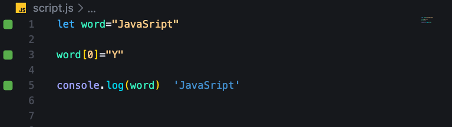

This expression does not change the string stored in the variable word.So, we can say that strings are not modifiable or in other words strings are immutable. Primitive data types are compared by its values. Let us compare different data types. See the example below:

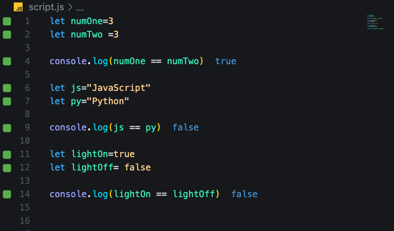

## Non-Primitive Data Types

*Non-Primitve data types* are modifiable or mutable. We can modify the value of non-primitive data types after it gets created. Let us see by creating an array. An array is a list of data values in a square bracket.Arrays can contain the same or different data types.Array values are referenced by their index.In JavaScript array index starts at zero. I.e, the first element of an array is found at index zero, the second element at index one, and the third element at index two, etc.

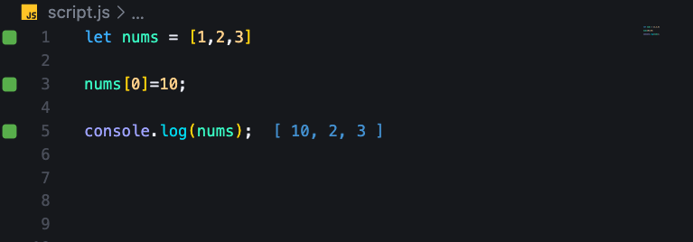

As you can see, an array, which is a *non-primitive data type* is **mutable**. ***Non-Primitive data types*** cannot be compared by value. Even if two ***non-primitive*** data types have the same properties and values, they are not strictly equal.

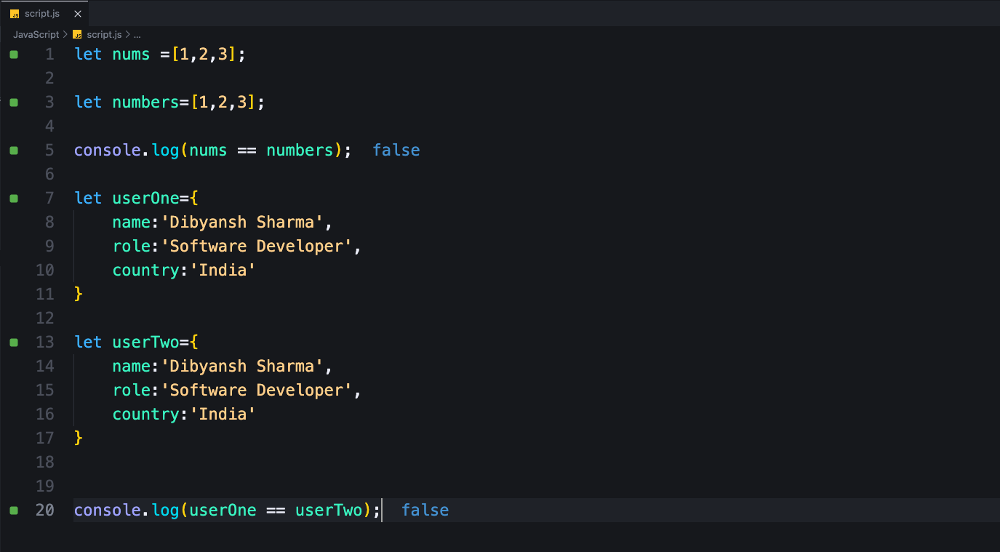

Rule of thumb, we do not compare non-primitive data types. Do not compare arrays,functions,or objects.Non-primtitve values are referred to as reference types, because they are compared by reference instead of value. Two objects are only strictly equal if they refer to the same underlying object.

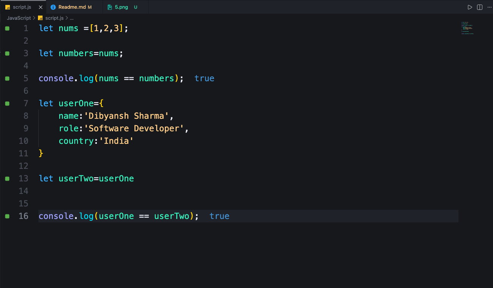

If you have a hard time understanding the difference between primitive data types and non-primitive data types, you are not the only one. Calm down and just go to the next section and try to come back after some time. Now let us start the data types by number type.

## Numbers

Numbers are integers and and decimal values which an do all the arithmetic operations. Let's see somw examples of numbers:

### Declaring Number Data Types

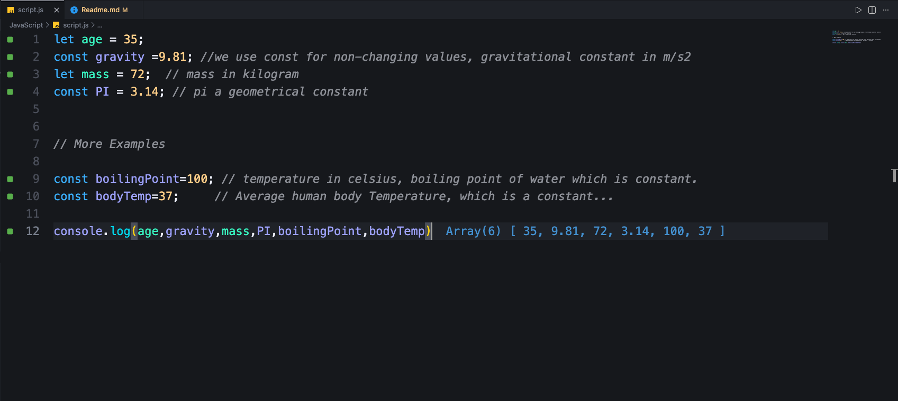

## Strings

Strings are text, which are under **single, double, back-tick** quote. To declare a string, we need a variable name, assignment operator, a value under a single quote, double quote, or backtick quote.Let's see some examples of strings:

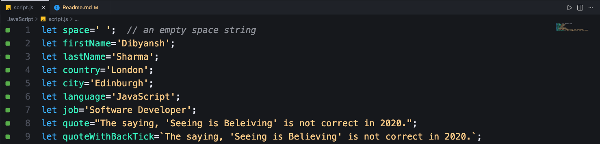

## String Concatenation

Connecting two or more strings together is called ***concatenation***.Using the strings declared in the previous String section:

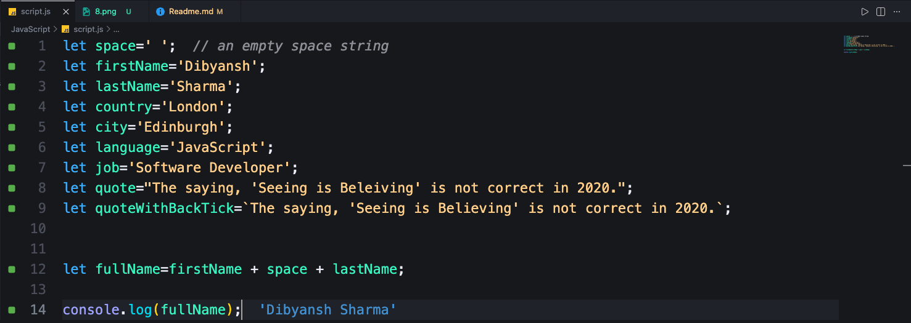

We can concatenate strings in different ways:

### Concatenation using Addition Operator

Concatenating using the addition operator is an old way.This way of concatenating is tedious and error-prone.It is good to know how to concatenate, this way but I strongly suggest to use the ***ES6*** template strings (explained later on ).

 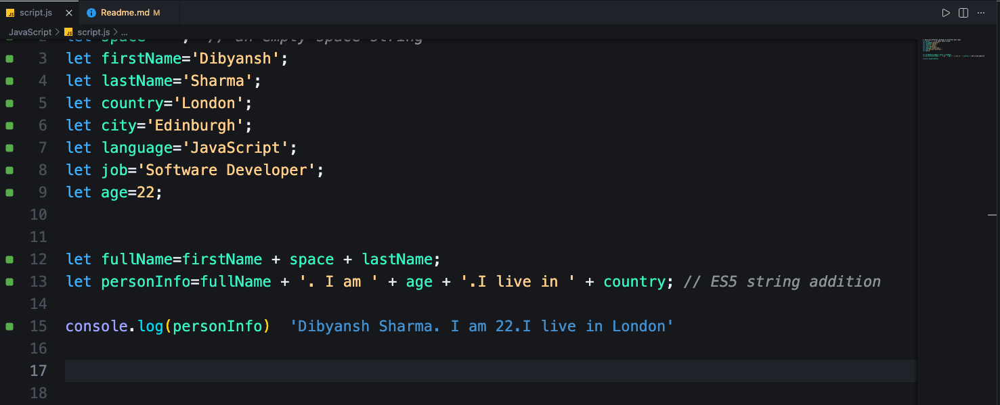

 ## Long Literal Strings

 A string could be a single character or paragraph or a page. If the string length is too big it does not fit in one line. We can use the ***backslash character(\)*** at the end of each line to indicate that the string will continue on the next line. 

 ***Example:***

 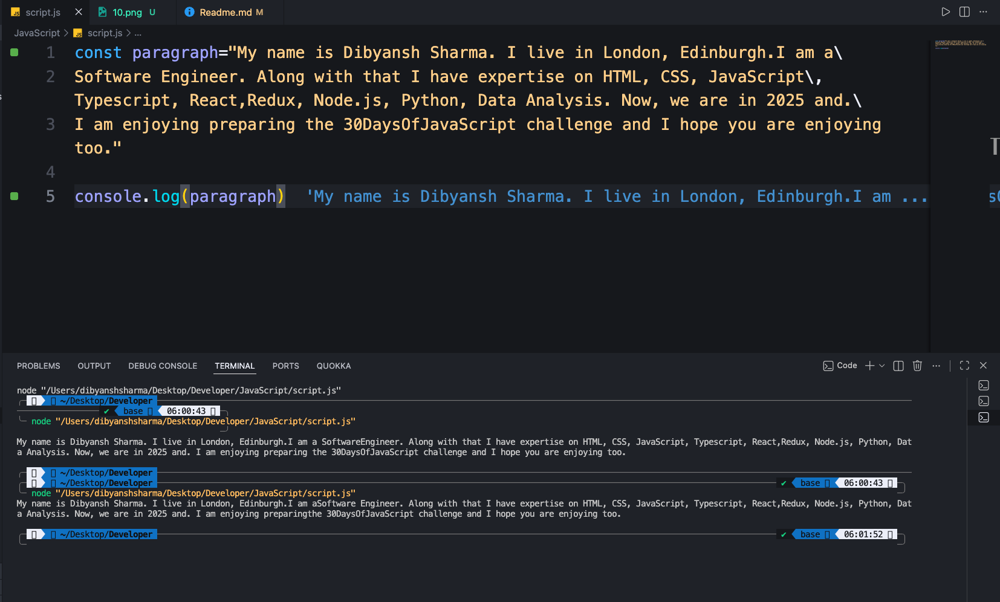

 ## Escape Sequences in Strings

 In JavaScript and other programming languages \ followed by some characters is an escape sequence.Let's see the most common escape characters:

- \n -> new line
- \t -> Tab, means 8 spaces
- \\ ->Back slash
- \' -> Single quote(')
- \" -> Double quote(")

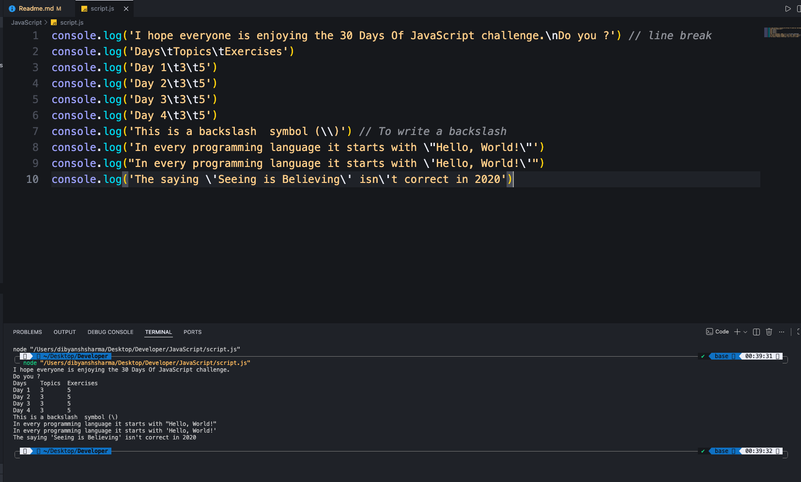

## Template Literals (Template Strings)

To create a template strings, we use two back-ticks.We can inject data as expressions inside a template string. To inject data,we enclose the expression with a curly bracket({}) preceded by a $ sign. See the Syntax below:

``` JavaScript
`String Literal text`
`String Literal text ${expression}
```

### Example 1:

``` JavaScript

console.log(`The sum of 2 and 3 is 5`)

let a=2
let b=3

console.log(`Sum of ${a} and ${b} is ${a+b}`)

```

### Example 2:

``` JavaScript

let firstName = 'Asabeneh'
let lastName = 'Yetayeh'
let country = 'Finland'
let city = 'Helsinki'
let language = 'JavaScript'
let job = 'teacher'
let age = 250
let fullName = firstName + ' ' + lastName

let personInfoTwo = `I am ${fullName}. I am ${age}. I live in ${country}.` //ES6 - String interpolation method
let personInfoThree = `I am ${fullName}. I live in ${city}, ${country}. I am a ${job}. I teach ${language}.`
console.log(personInfoTwo)
console.log(personInfoThree)

```
### Output
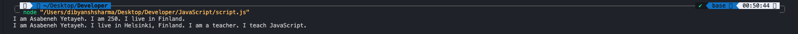

Using a string template or string interpolation method, we an add expressions, which could be a value, or some operations(comparison,arithmetic operations,ternary operations).

``` JavaScript

let a=2;
let b=3;

console.log(`${a} is greater than ${b} :${a>b}`);

```

### Output
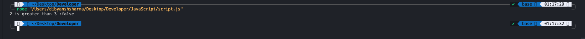

## String Methods

Everything in JavaScript is an object. A string is a primitive data type that means we can not modify it one it is created.The string object has many string methods.There are different string methods that an help us to work with strings.

> ***length:*** The string length method returns the number of characters in a string included empty space. 

### Example:

``` JavaScript

let js='JavaSript';
console.log(js.length); // 10
let firstName="Dibyansh";
console.log(firstName.length); // 8
```

> ***Accessing characters in a string:*** We can access each character in a string using its index.In programming, counting starts from 0. The first index of the string is zero,and the last index is the length of the string minus one.

Let us access different characters in 'JavaScript' string:

``` JavaScript

let string="JavaScript";

let firstLetter=string[0];

console.log(firstLetter); // J

let secondLetter=string[1]; // a

let thirdLetter=string[2]; // v

let lastLetter=string[9];

console.log(lastLetter); // t

let lastIndex=string.length-1;

console.log(string[lastIndex]); //t

```

### Output :


> toUpperCase(): this method changes the string to uppercase letters.

``` JavaScript

let string="javascript";

console.log(string.toUpperCase());

let firstName="Dibyansh";

console.log(firstName.toUpperCase());

let Country="India";

console.log(Country.toUpperCase());

```
### Output :

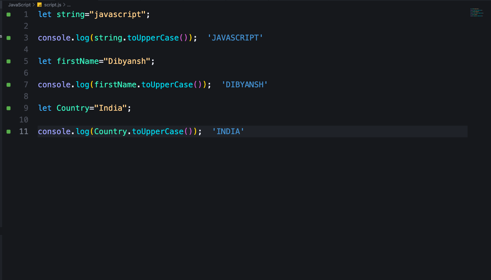;

> toLowerCase():this method changes the string to lowercase letters.

``` JavaScript

let string="JavaSCript";

console.log(string.toLowerCase());

let firstName="DIBYANSH";

console.log(firstName.toLowerCase());

let Country="INDIA";

console.log(Country.toLowerCase());

```

### Output :


> substr() : It takes two arguments, the starting index and number of characters to slice.

``` JavaScript

let string="JavaScript";

console.log(string.substr(4,6));

let Country="Finland";

console.log(Country.substr(3,4));

```

### Output :

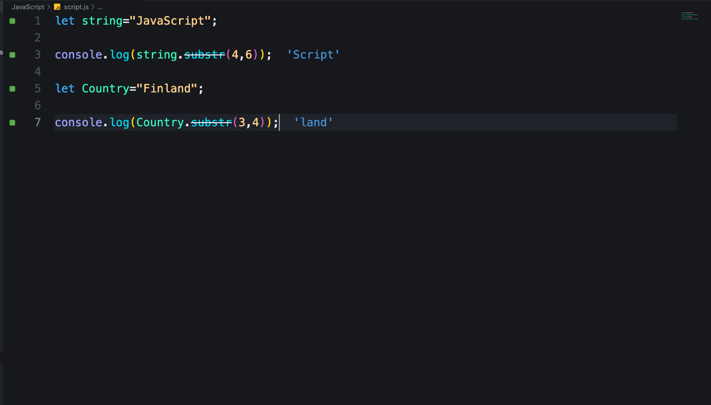

> substring(): It takes two arguments, the starting index and the stopping index but it doesn't include the character at the stopping index.

``` JavaScript

let string="JavaScript";

console.log(string.substring(0,4));

console.log(string.substring(4,10));

console.log(string.substring(4));

let Country="Edinburgh";

console.log(Country.substring(0,3));

console.log(Country.substring(3,7));

console.log(Country.substring(3));

```

### Output :

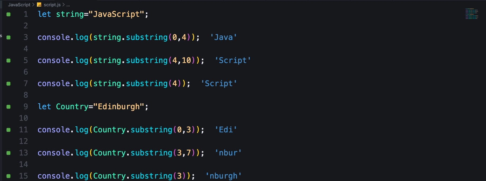

> split: The split method splits a string at specified place.

``` JavaScript

let string="30 Days of JavaScript";

console.log(string.split()); // Changes to an array -> ["30 Days of JavaScript"]
console.log(string.split(' ')); // Split to an array at space -> ["30","Days","of","JavaScript"]

let firstName="Dibyansh";

console.log(firstName.split()); // Change to an Array -> ["Dibyansh"]
console.log(firstName.split('')); // Split to an Array at each letter ->["D","I","B","Y","A","N","S",H"];


let countries="Finland, Sweden, Norway, Denmark, and Iceland";

console.log(countries.split(','));  // Split to an array at comma -> ["Finland"," Sweden"," Norway"," Denmark"," and Iceland"]
console.log(countries.split(', ')); // ["Finland","Sweden","Norway","Denmark","and Iceland"]

```

### Output :


> trim() : Removes trailing spaces in the beginning or at the end of a string.

``` JavaScript

let string='            30 Days of JavScript             ';

console.log(string);
console.log(string.trim(' '));

let name="        Dibyansh Sharma            ";

console.log(name);
console.log(name.trim()); // still removes the spaces at the beginning and the end of the string.

```

### Output :

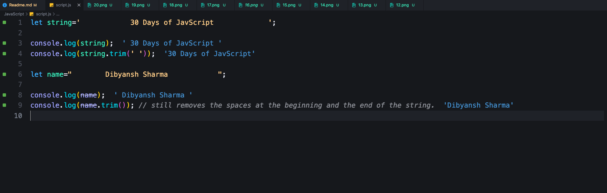

> includes() : It takes a substring argument and it cheks if substring argument exists in the string. includes()  returns a boolean.If a substring exists in a string, it returns true,otherwise it returns false.

``` JavaScript

let string="30 Days Of JavaScript";

console.log(string.includes("days")); // false -> it is ase sensitive
console.log(string.includes("Days"));// true
console.log(string.includes("Script")); // true
console.log(string.includes("script")); // false
console.log(string.includes("Java"));   // true
console.log(string.includes("java"));   // false

let country ="Finland";

console.log(country.includes("Fin")); // true
console.log(country.includes("fin")); // false
console.log(country.includes("Land")); // false
console.log(country.includes("land")); // true

```

### Output:

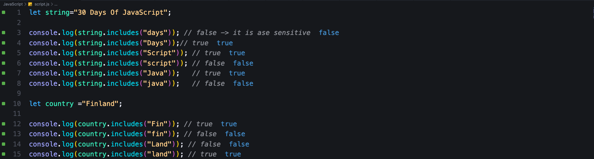

> replace() : takes as  a parameter the old substring and a new substring.

### Syntax :

``` JavaScript

string.replace(oldsubstring,newsubstring)

```

### Example:

``` JavaScript

let string = "30 Days of JavaScript";

console.log(string.replace('JavaScript','Python')); // 30 Days of Python

let country='Finland';

console.log(string.replace('Fin','Noman')); // Nomanland

```

### Output:

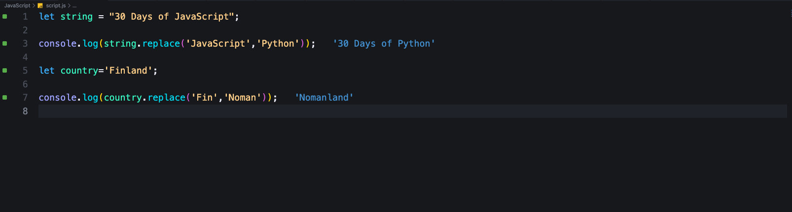

> CharAt() : Takes index and it returns the value at that index.

### Syntax :

``` JavaScript

string.CharAt(index)

```

### Output :

``` JavaScript

let string="30 Days of JavaSript";

console.log(string.charAt(0)) // 3

let lastIndex=string.length-1;

console.log(string.charAt([lastIndex])); // t

```

### Output :

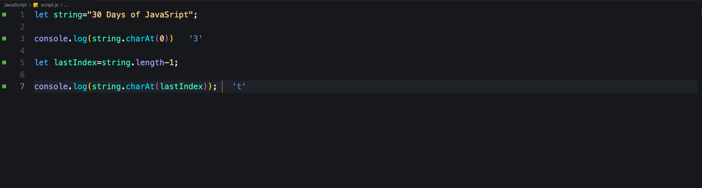

> charCodeAt(): Takes index and it returns char code(ASCII number) of the value at that index.

### Syntax :

``` JavaScript

string.charCodeAt(index);

```

### Example :

``` JavaScript

let string ="30 Days Of JavaScript";

console.log(string.charCodeAt(3)); // D ASCII number is 68

let lastIndex=string.length-1;

console.log(string.charCodeAt(lastIndex)); // t ASCII number is 116

```

### Output :

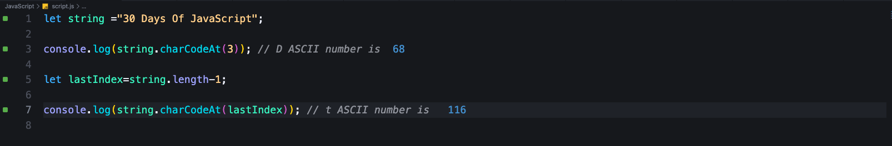

> indexOf() : Takes a substring and if the substring exists in a string it returns the first position of the substring if does. not exists it return -1.

### Syntax :

``` JavaScript

string.indexOf(substring)

```

### Example :

``` JavaScript

let string = "30 Days of JavaScript"

console.log(string.indexOf('D'));

console.log(string.indexOf("Days"));

console.log(string.indexOf("days"));

console.log(string.indexOf('a'));

console.log(string.indexOf('JavaSript'));

console.log(string.indexOf('Script'));

console.log(string.indexOf('script'));

```
### Output

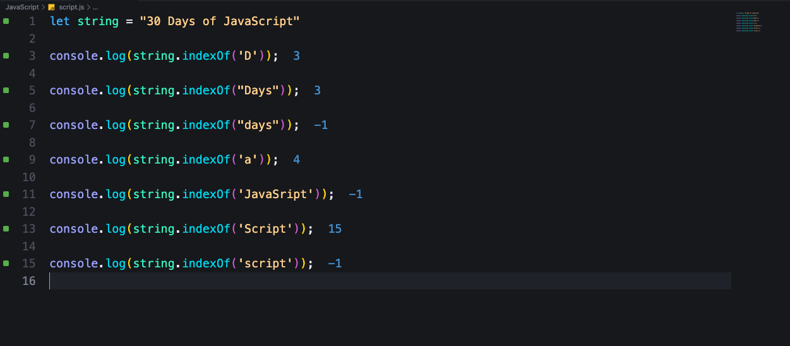

> lastIndexOf() : Takes a substring and if the substring exists in a string it returns the last position of the substring if it does not exist it returns -1.

### Syntax :

``` JavaScript

// Syntax 

string.lastIndexOf(substring);

```

### Example :

``` JavaScript

let string= 'I love JavaSript. If you do not love JavaSript what else can you love.';

console.log(string.lastIndexOf('JavaScript'));

console.log(string.lastIndexOf('love'));

console.log(string.lastIndexOf('you'));

```

### Output :

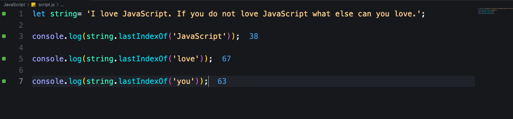

> concat() : it takes many substrings and joins them.

### Syntax :

``` JavaScript

string.concat(substring,substring,substring);

```

### Example :

``` JavaScript

let string="30";

console.log(string.concat("Days","Of","JavaScript"));

let country="Fin";

console.log(string.concat("land"));

```

### Output :

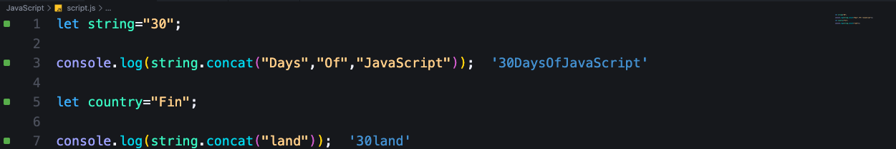

> startsWith() : It takes a substring as an argument and it checks if the string starts with that speified substring.It returns a boolean value either **true** or **false**

### Syntax :

``` JavaScript

string.startsWith(substring);

```

### Example : 

``` JavaScript

let string = "Love is the best thing in the world";

console.log(string.startsWith('Love')); // true

console.log(string.startsWith('love')); // false

console.log(string.startsWith('world')); // false

let country='EdinBurgh';

console.log(country.startsith('Edin')); // true

console.log(country.startsWith('edin')); // false

console.log(country.startsWith('land')); // false

```

### Output :

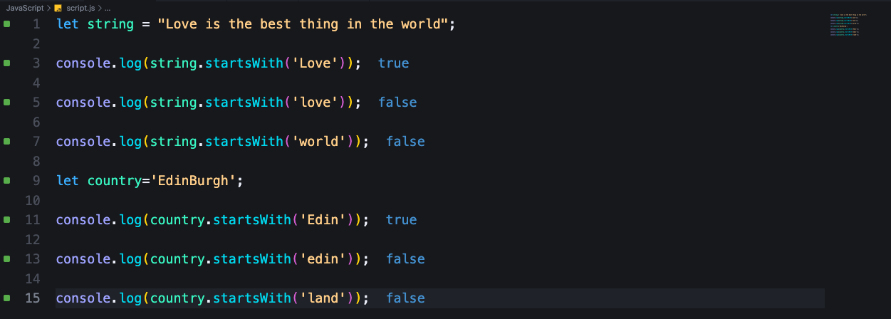

> endsWith() : It takes a substring as an argument and it checks if the string ends with that specified substring.It returns a boolean value either **true** or **false**.

### Syntax :

``` JavaScript

string.endsWith(substring);

```

### Example :

``` JavaScript

let string = "Love is the most powerful feeling in the world."

console.log(string.endsWith('World.'));

console.log(string.endsWith('world.'));

console.log(string.endsWith('in the world.'));

let country = 'Europe';

console.log(country.endsWith('rope'));

console.log(country.endsWith('Rope'));

console.log(country.endsWith('land'));

```

### Output :

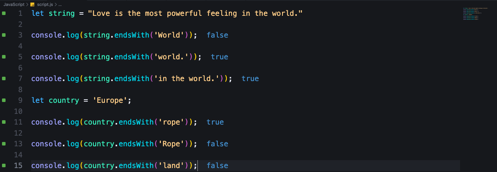

> search() : It takes a substring as an argument and it returns the index of the first match. The search value an be a string or a regular expression pattern.

### Syntax :

``` JavaScript

string.search(substring);

```

### Example :

``` JavaScript

let string = "I love JavaSript. If you do not love JavaScript what else an you love".

console.log(string.search('love'));

console.log(string.search(/javasript/gi));

```

### Output :

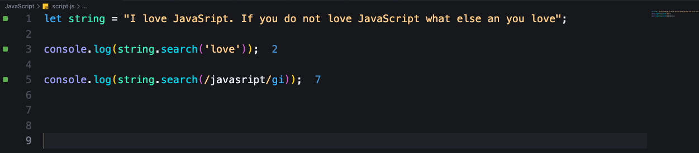

> repeat() : It takes a number as an argument and returns the repeated version of the string.

### Syntax :

``` JavaScript 

string.repeat(n);

```

### Example :

``` JavaScript

let string="love";

console.log(string.repeat(5));

```

### Output :

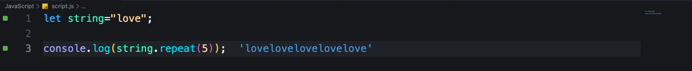

## Checking Data Types and Casting :

To check the data type of a certain variable we use the ***typeof*** method.

### Example :

``` JavaScript

// Different javascript data types 
// Let's delare different data types

let firstName ="Dibyansh";  // string
let lastName="Sharma";     // string
let country="Europe";     // string
let age=22;              // number
let job;                // undefined, because a value was not assigned.


console.log(typeof 'Dibyansh'); // string

console.log(typeof firstName); // string

console.log(typeof 10);       // number
 
console.log(typeof 3.14);    // number

console.log(typeof true);   // boolean

console.log(typeof false); // boolean

console.log(typeof NaN);  // number

console.log(typeof job); // undefined

console.log(typeof undefined); // undefined

console.log(typeof null);   // object

```

### Output :

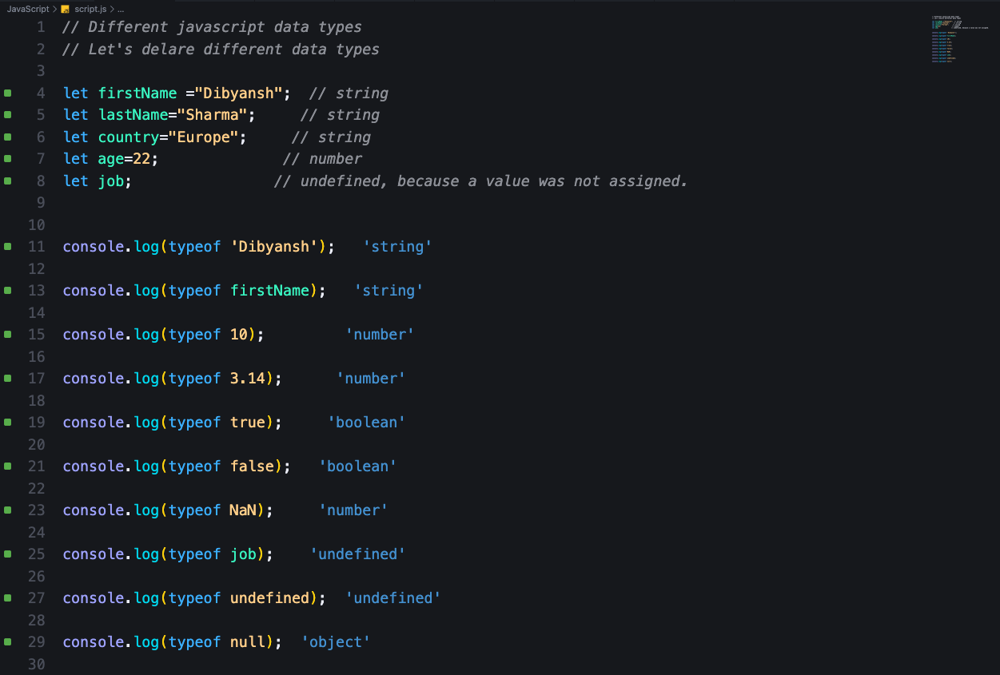

## Changing Data Type (Casting)

- ***Casting*** : Converting one data type to another data type. We use **parseInt()**, **parseFloat()**, **Number()**, **+ sign**, **str()** . When we do arithmetic operations string numbers should be first converted to integer or float if not it returns an ***error***.

### String to Int :

- We can convert string number to a number . Any number inside a quote is a string number. An example of a string number : '10', '5', etc. We can convert string to number using the following methods :

- **parseInt()**
- **Number**
- **Plus sign(+)**

### Example :

``` JavaScript

let num = '10';

let numInt = parseInt(num);

console.log(numInt); // 10

```

``` JavaScript

let num ='10';

let numInt= Number(num);

console.log(numInt); // 10

```

``` JavaScript

let num = '10';

let numInt= +num;

console.log(numInt) // 10

```

### Output:

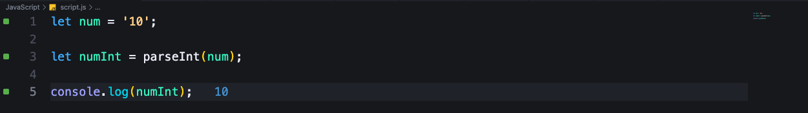

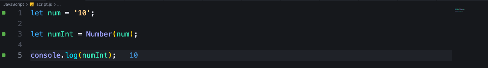

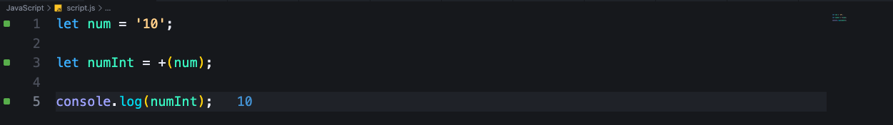


## String to Float :

- We can convert string float number to a float number . Any float number inside a quote is a string float number. An example of a string float number : '9.81', '3.14', '1.44', etc. We can convert string float number to a number using the following methods:

- **parseFloat()**
- **Number()**
- **Plus sign(+)**

### Example :

``` JavaScript

let num = '9.81';

let numFloat = parseFloat(num);

console.log(numFloat); // 9.81

```

``` JavaScript

let num ='9.81';

let numFloat= Number(num);

console.log(numFloat); // 9.81

```

``` JavaScript

let num = '9.81';

let numFloat= +num;

console.log(numFloat) // 9.81

```

### Output :

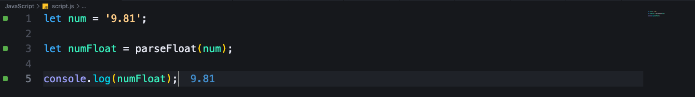

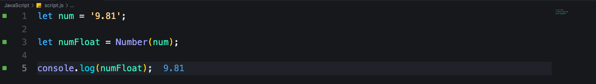

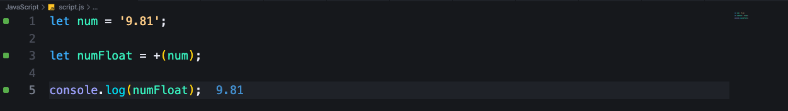

## Float to Int :

 We can convert float numbers to integers.We use the following method to convert float to int.

- parseInt()

### Example :

``` JavaScript

let num =9.81;

let numInt=parseInt(num);

console.log(numInt);

```

### Output :


---

# Day 3

## Booleans

A boolean data type represents one of the two values **either true or false**. Boolean value is either true or false. The use of these data types will be clear when you start the ***comparison*** operator. Any comparisons return a boolean value which is either true or false.

### Example : Boolean Values :

``` JavaScript

let isLightOn=true;
let isRaining =false;
let isHungry = false;
let isMarried = true;
let truValue= 4>3;      //true 
let falseValue = 4<3;      // false

```
- We agreed thjat boolean values are either true or false.


### Truthy Values 

- All numbers (positive and negative) are truthy except zero.
- All strings are truthy except an empty string ('').
- The boolean true.


### Falsy Values

- 0
- 0n
- null
- undefined
- NaN
- the boolean false
- '',"",``, empty string

> It is good to remember those truthy values and falsy values. In later section, we will use them with conditions to make decisions.

### Undefined

> If we  declare a variable and if we do not assign avalue, the value will be ***undefined***. In addition, to this, if a function is not returning the value, it will be undefined.

### Example :

``` JavaScript

let firstName;

console.log(firstName); // not defined, because it is not assigned to a value yet

```

### Output :


### Null

### Example :

``` JavaScript

let empty= null

console.log(empty) // -> null , means no value

```

### Output :

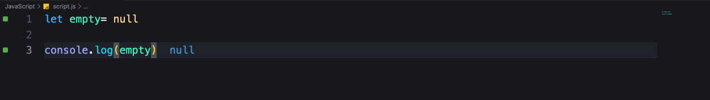


## Operators

> Assignment Operators : An equal sign in JavaScript is an assignment operator. It uses to assign a variable.

``` JavaScript

let firstName="Dibyansh";
let country="Europe";

```

***Assignment Operators***

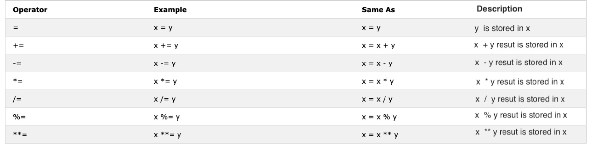

### Arithmetic Operators 

> Arithmetic operators are mathematical operators.

- Addition(+) : a+b
- Subtraction(-): a-b
- Multiplication(*)
- Division(/): a/b
- Modulus(%): a%b
- Exponential(**)

### Example 1 :

``` JavaScript

let numOne=4
let numTwo=3

let sum=numOne + numTwo
let diff=numOne - numTwo
let mult= numOne * numTwo
let div= numOne / numTwo
let remainder= numOne % numTwo
let powerOf= numOne ** numTwo

console.log(sum, diff, mult, div, remainder, powerOf)

```

### Output :

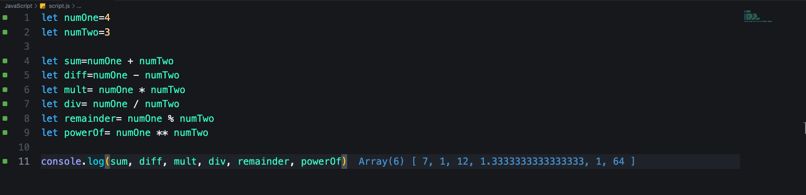

### Example 2:

``` JavaScript

const Pi=3.14
let radius = 100 // length in meter

// Let us calculate area of a circle

const areaOfCircle=Pi*radius*radius

console.log(areaOfCircle)  //314 m

const gravity = 9.81  // in m/s2
let mass = 72        // in kilogram

// Let us calculate weight of an object

const weight = mass * gravity
console.log(weight)             706.32 N(Newton)


const boilingPoint=100  // temperature in oC, boiling point of water
const bodyTemp=37      // body temperature in oC

// Concatenating string with numbers using string interpolation

/*
  The boiling point of water is 100 oC.
  Human body temperature is 37 oC.
  The gravity of earth is 9.81 m/s2.

*/

console.log(`The boiling point of water is ${boilingPoint} oC.\n Human body temperature is ${bodyTemp} oC.\nThe gravity of earth is ${gravity} m/s2.`)

```

### Comparison Operators

> In programming we compare values, we use comparison operators to compare two values. We check if a value is ***greater or less or equal to other value***.

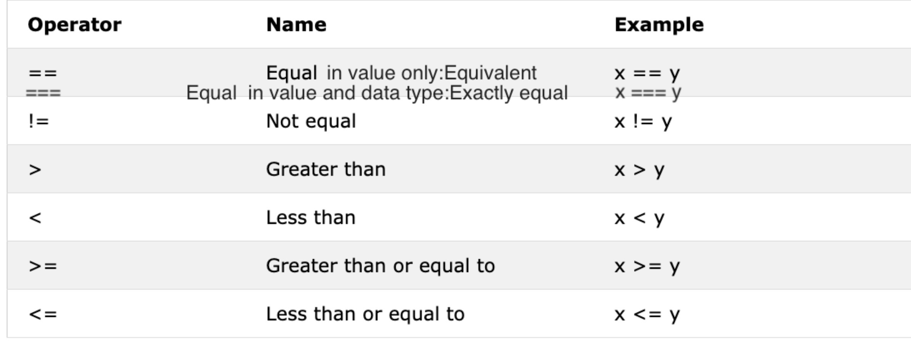

### Example : Comparison Operators

``` JavaScript

console.log(3 > 2)              // true, because 3 is greater than 2
console.log(3 >= 2)             // true, because 3 is greater than 2
console.log(3 < 2)              // false,  because 3 is greater than 2
console.log(2 < 3)              // true, because 2 is less than 3
console.log(2 <= 3)             // true, because 2 is less than 3
console.log(3 == 2)             // false, because 3 is not equal to 2
console.log(3 != 2)             // true, because 3 is not equal to 2
console.log(3 == '3')           // true, compare only value
console.log(3 === '3')          // false, compare both value and data type
console.log(3 !== '3')          // true, compare both value and data type
console.log(3 != 3)             // false, compare only value
console.log(3 !== 3)            // false, compare both value and data type
console.log(0 == false)         // true, equivalent
console.log(0 === false)        // false, not exactly the same
console.log(0 == '')            // true, equivalent
console.log(0 == ' ')           // true, equivalent
console.log(0 === '')           // false, not exactly the same
console.log(1 == true)          // true, equivalent
console.log(1 === true)         // false, not exactly the same
console.log(undefined == null)  // true
console.log(undefined === null) // false
console.log(NaN == NaN)         // false, not equal
console.log(NaN === NaN)        // false
console.log(typeof NaN)         // number

console.log('mango'.length == 'avocado'.length)  // false
console.log('mango'.length != 'avocado'.length)  // true
console.log('mango'.length < 'avocado'.length)   // true
console.log('milk'.length == 'meat'.length)      // true
console.log('milk'.length != 'meat'.length)      // false
console.log('tomato'.length == 'potato'.length)  // true
console.log('python'.length > 'dragon'.length)   // false

```

### Output :

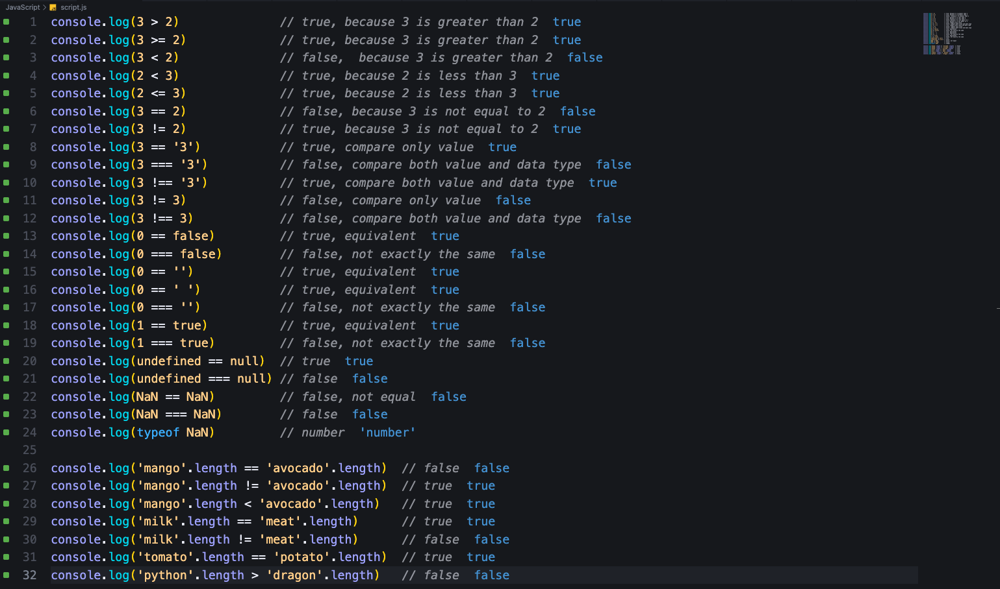

Try to understand the above comparisons with some logic.Remembering without any logic might be difficult. JavaScript is somehow a wired kind of programming language.JavaScript code run and give you a result but unless you are good it may not be the desired result.

As a rule of thumb, if a value si not true with **==** it will not be equal with **===**. Using **===** is safer than using **==**. The following [link](https://dorey.github.io/JavaScript-Equality-Table/) has an exhaustive list of comparisons of data types.


### Logical Operators 

> The following symbols are the common logical operators:**&&(ampersand), ||(pipe)and !(negation)**.The **&&** operator gets true only if thge two operands are true. The **||** operator gets true either of the one operand is true. The **!(negation)** operator negates **true** to **false** and **false** to **true**.

### Example :

``` JavaScript

// && ampersand operator example

const check = 4 > 3 && 10 > 5         // true && true -> true
const check = 4 > 3 && 10 < 5         // true && false -> false
const check = 4 < 3 && 10 < 5         // false && false -> false

// || pipe or operator, example

const check = 4 > 3 || 10 > 5         // true  || true -> true
const check = 4 > 3 || 10 < 5         // true  || false -> true
const check = 4 < 3 || 10 < 5         // false || false -> false

//! Negation examples

let check = 4 > 3                     // true
let check = !(4 > 3)                  //  false
let isLightOn = true
let isLightOff = !isLightOn           // false
let isMarried = !false                // true

```

### Increment Operator 

> In JavaScript we use the increment operator to increase a value stored in a variable. The **increment** could be **pre** or **post** increment. Let us see each of them :

1. Pre-increment:

### Example :
``` JavaScript

let count = 0;

console.log(++count);    // 1
console.log(count);     // 1
```

### Output


2. Post-increment

### Example :

``` JavaScript

let count = 0;

console.log(count++);  // 0
console.log(count);   //  1

```

### Output:

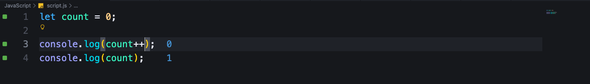

- We use most of the time **post-increment**. Atleast you should remember how to use **post-increment** operator.

### Decrement Operator

> In JavaScript, we use the decrement operator to decrease a value stored in a variable. The decrement could be **pre** or **post** **decrement**.Let use see each of them :

1. Pre-decrement

``` JavaScript

let count = 0;

console.log(--count)  // -1
console.log(count)   // -1

```

### Output :

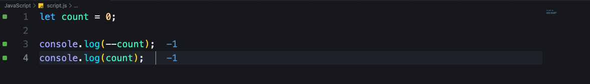

2. Post-decrement

``` JavaScript

let count = 0;

console.log(count--); // 0
console.log(count);  // -1

```

### Output

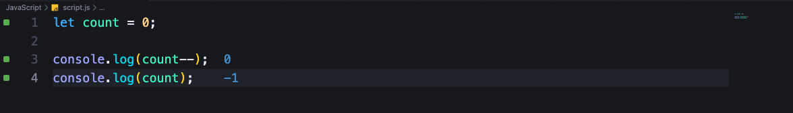

### Ternary Operator

> Ternary Operator allows to write a condition. Another way to write conditions is using ***ternary operators.*** Look at the following examples :

Example 1 :
``` JavaScript

let isRaining=true;

isRaining?console.log("You need a rain coat..."):console.log("No need for a rain coat...")


let is Raining=false;
isRaining?console.log("You need a rain coat..."):console.log("No need for a rain coat...")
```

### Output :

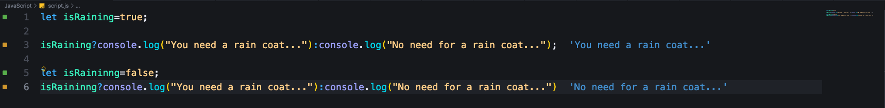

### Example 2:

``` JavaScript

let number = 5;

number>0?console.log(`${number} is a positive number...`):console.log(`${number} is a negative number...`);

number = -5;

number>0?console.log(`${number} is a positive number...`):console.log(`${number } is a negative number...`);

```

### Output :

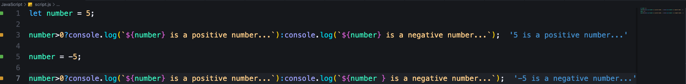

### Operator Precedence :

> I would like to recommend you to read about operator precedence from this [link](https://developer.mozilla.org/en-US/docs/Web/JavaScript/Reference/Operators/Operator_precedence)


## Window Methods :

### Window alert() method

As you have seen at very beginning ***alert()*** method displays an alert box with a specified message an an ***OK*** button. It is a builtin method and it takes on argument.

### Syntax : 

``` JavaScript

alert(message)

```

### Example :

``` JavaScript

alert("Welome to 30DaysOfJavaScript");

```

- Do not use too much ***alert()*** because it is destructing and annoying, use it to test.

### Window prompt() method

> The ***window prompt*** method displays a prompt box with an input on your browser to take input values and input data can be stored in a variable. The prompt() method takes two arguments. The second argument is optional.

### Syntax :

``` JavaScript

prompt('required text','optional text');

```

### Example :

``` javaScript

let number = prompt("Enter a number","number goes here");

console.log(number);

```

### Window confirm() method

> The ***confirm()*** method displays a dialog box with a specified message, along with an ****OK and a  Cancel button.*** A ***confirm*** box is often used to ask permission from a user to execute something. ***Window confirm()*** takes a string as an argument.Clicking the ***OK*** yields true value, whereas clicking the ***Cancel button*** yields false value.

### Example :

``` JavaScript

const agree = confirm('Are you sure you like to delete?');

console.log(agree); // Results will be true or false based on what you click on the dialog bo.

```

- These are not all the ***window methods*** we will have a seperate section to go deep into ***window methods***.


## Date Object

> Time is an important thing. We like to know the time a certain event or activity. In JavaScript current time and date is created using ***JavaScript Date Object.*** The Object we create using Date object provides many methods to work with date and time.The methods we use to get date and time information from a date object values are started with a word ***get*** because it provide the information. ***getFullYear(),getMonth(), getDate(), getDay(), getHours(), getMinutes(), getSeconds(), getMilliseconds(), getTime(), getDay().***

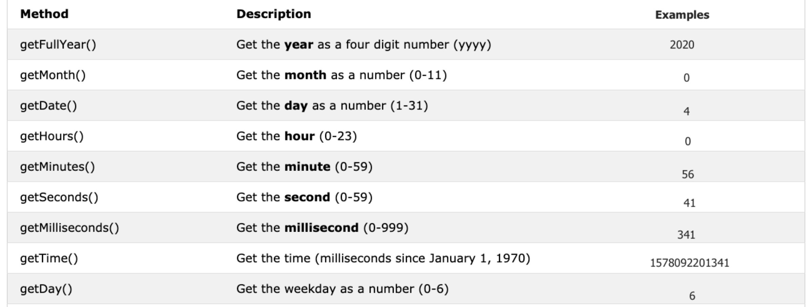

## Creating a time object :

> Once we create time object. The time object will provide information about time. Let us create a timw object.

### Example :
``` JavaScript

const now = new Date();

console.log(now);

```

### Output :

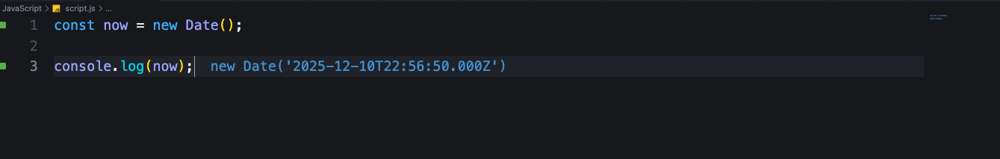

- We have created a time object and we can access any date time information from the object using the get methods we have mentioned on the table :

## Getting full year

> Let's extract or get the full year from a time object.

### Example :

``` JavaScript

const now = new Date();

console.log(now.getFullYear());

```

### Output :

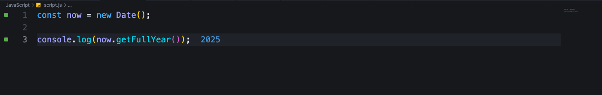

## Getting month

> Let's extract or get the month from a time object.

### Example :

``` JavaScript

const now = new Date();

console.log(now.getMonth()); // month starts from 0 (0-11)

```

### Output :

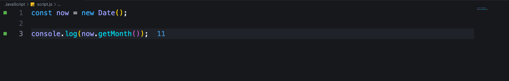

## Getting Date

> Lets's extract or get the date of the month from a time object.

### Example :

``` JavaScript

const now = new Date();

console.log(now.getDate());

```

### Output :

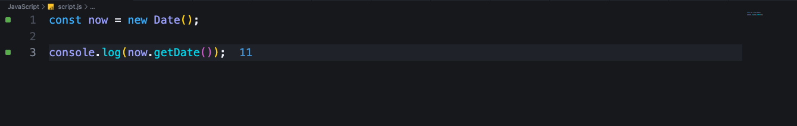

## Getting day

> Let's extract or get the day of the week from a time object.

### Example :

``` JavaScript

const now = new Date();

console.log(now.getDay());

// Sunday is 0, Monday is 1 and Saturday is 6.

// Geeting the weekday as a number (0-6).

```

### Output :

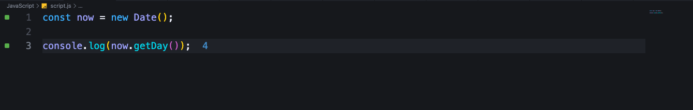

## Getting hours

> Let's extract or get the hours from a time object.

### Example :

``` javaScript

const now = new Date();

console.log(now.getHours());

```

### Output :


## Getting minutes

> Let's extract or get the minutes from a time object.

### Example :

``` JavaScript

const now = new Date();

console.log(now.getMinutes());

```

### Output :


## Getting seconds

> Let's extract or get the seconds from a time object.

### Example :

``` JavaScript

const now = new Date();

console.log(now.getSeconds());

```

### Output :

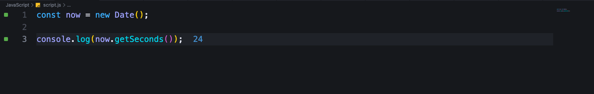

## Getting time

> This method gives time in milliseconds starting from ***January 1, 1970.*** It is also known as ***Unix time.*** We an get the ***unix time*** in two ways :

1. **Using getTime()**

### Example :

``` JavaScript

const now = new Date();

console.log(now.getTime()); // 1765409003956, this is the number of seconds passed from January 1,1970 to December 11, 2025

```

### Output :

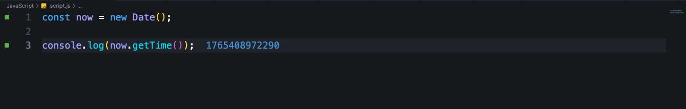


2. **Using Date.now()**

### Example :

``` JavaScript 

const allSeconds = Date.now();

console.log(allSeconds);

const timeInSeconds = new Date().getTime();

console.log(allSeconds == timeInSeconds);

```

### Output :

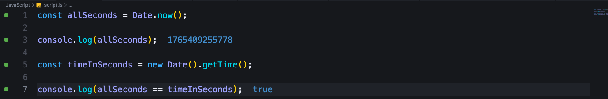

- Let us format these values to a human readable time format.

### Example :

``` JavaScript

const now = new Date();

const year = now.getFullYear();  // return year

const month = now.getMonth();   // return month(0-11)

const date = now.getdate();    // return date(1-31)

const hours = now.getHours(); // return hours(0-23)

const minutes = now.getMinutes(); // return minutes(0-59)

console.log(`${date}/${month}/${year}  ${hours}:${minutes}`);

```

### Output :

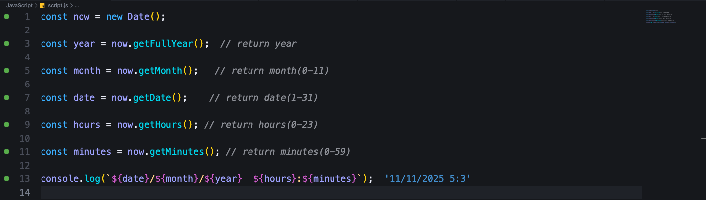

# Day-4

## Conditionals

> Conditional statements are used for make decisions based on different conditions.By default, statements in JavaScript script executed sequentially from top to bottom. If the processing logic require so, the sequential flow of execution an be altered in two ways :

- ***Conditional Execution*** : A block of one or more statements will be executed if a certain expression is true.

- ***Repetitive Execution*** : A block of one or more statements will be repetitively executed if a certain expression is true. In this section, we will cover **if, else, else if statements.** The comparison and logical operators we learned in the previous sections will be useful in here.

Conditions can be implementing using the following ways :

- if
- if else
- if else if else
- switch 
- ternary operator

## If

> In JavaScript and other programming languages the ***keyword*** **if** is used to check if a condition is true and to execute the block code. To create an if condition, we need **if** keyword, condition inside a paranthesis and block of code inside a curly bracket({}).

### Syntax :

``` JavaScript

// Syntax

if (condition)
{
  // this part of code runs for truthy condition...

}

```

### Example :

``` JavaScript

let num = 3;

if(num>0)
{
  console.log(`${num} is a positive number`);

}

```

### Output :

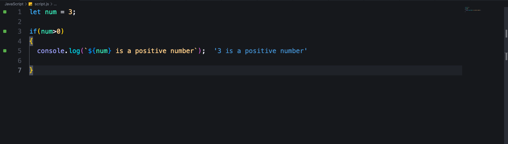

> As, you can see in the condition example above, 3 is greater than 0, so it is a positive number. The condition was ***true*** and the block of code was executed. However, if the condition is ***false***, we won't see any results. 

### Example 2 :

``` JavaScript

let isRaining = true;

if(isRaining)
{
  console.log("Remember to take your rain coat...");

}
```
### Output :

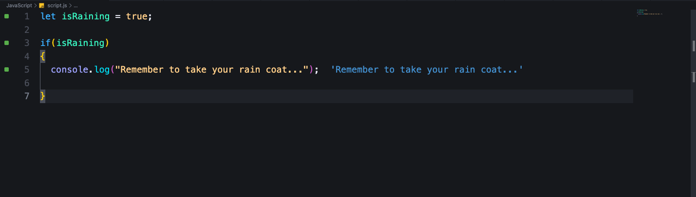

> The same goes here for the second condition, if isRaining is ***false*** the **if** block will not be executed and we do not see any output.In order to see the result of a ***falsy*** condition, we should have another block, which is going to be ***else***.

# If Else 

> If the **if** condition is ***true*** the first block which is **if** block will be executed, if the **if** condition is not true or we can if its ***false*** then the **else** condition will be executed.

### Syntax :

``` JavaScript

// Syntax

if(condition)
{
  // this part of the code runs for truthy condition
}
else
{
  // this part of the code runs for falsy condition
}
```
### Example 1 :

``` JavaScript

let num = 3;

if(num>0)
{
  console.log(`${num} is a positive number`);
}
else
{
  console.log(`${num} is a negative number`);
}

num = -3;

if(num>0)
{
  console.log(`${num} is a positive number`);
}
else
{
  console.log(`${num} is a negative number`);
}

```

### Output :

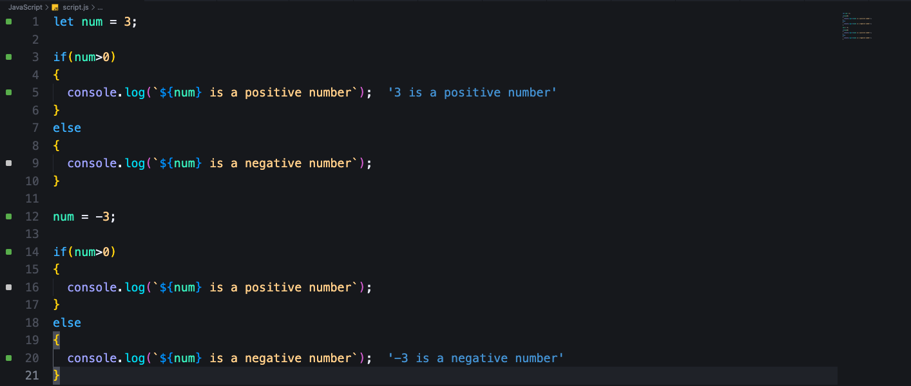

### Example 2 :

``` JavaScript

let isRaining = true;

if(isRaining)
{
  console.log(`You need a rain coat.`);
}
else
{
  console.log(`No need for a rain coat.`);
}

isRaining = false;

if(isRaining)
{
  console.log(`You need a rain coat.`);
}
else
{
  console.log(`No need for a rain coat.`);
}

```

### Output :

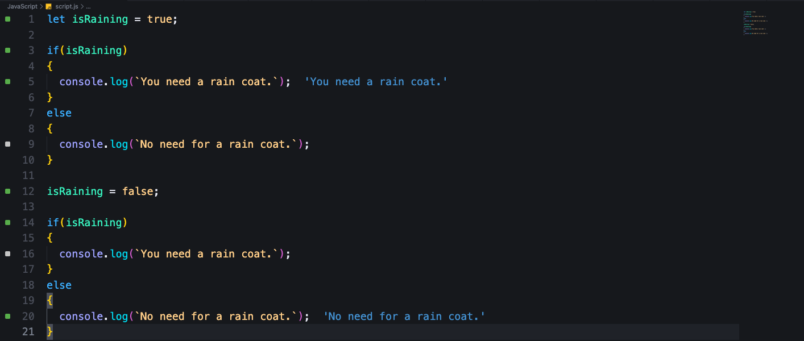

> The last condition is false, therefore the else block was executed. What if we have more than two conditions? In that case, we would use **else if** conditions.

# If->Else if-> Else

> On our daily life, we make decisions on daily basis. We make decisions not by checking one or two conditions instead we make decisions based on multiple conditions. As similar to our daily life, programming is also full of conditions. We use **else if** when we have multiple conditions.

## Syntax :

``` JavaScript 

// Syntax 

if(condition)
{
   // if-block code
}
else if(condition)
{
   // else-if block code 
}
else
{
   // else-block code
}

```

### Example 1 :

``` JavaScript 

let a = 0;

if(a > 0)
{
  console.log(`${a} is a positive number`);
}
else if(a == 0)
{
  console.log(`${a} is zero`);
}
else if(a< 0)
{
  console.log(`${a} is a negative number`);
}
else
{
  console.log(`${a} is not a number`);
}

```

### Output :

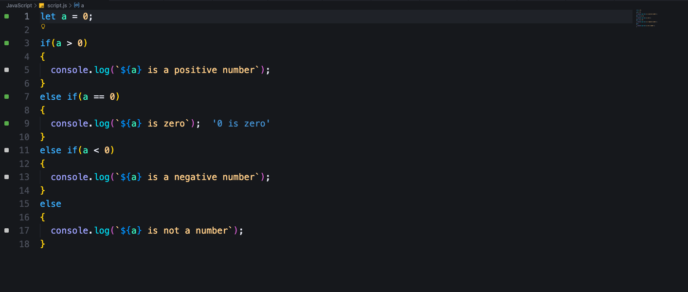

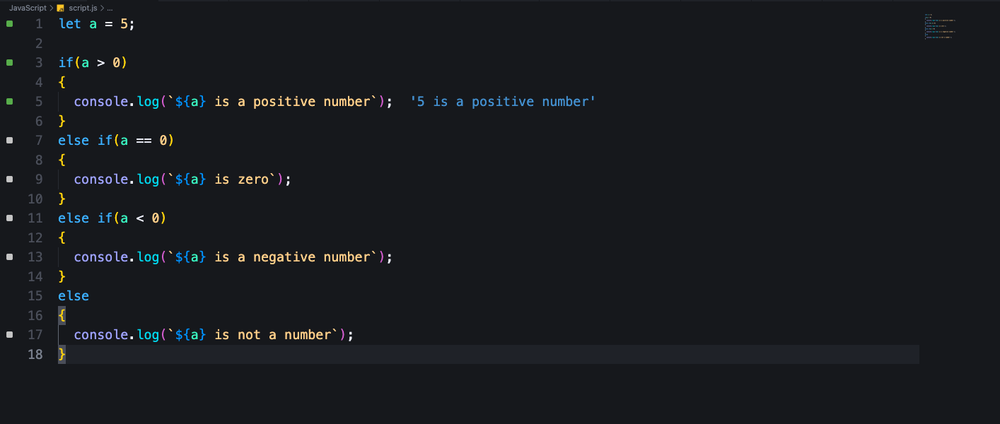

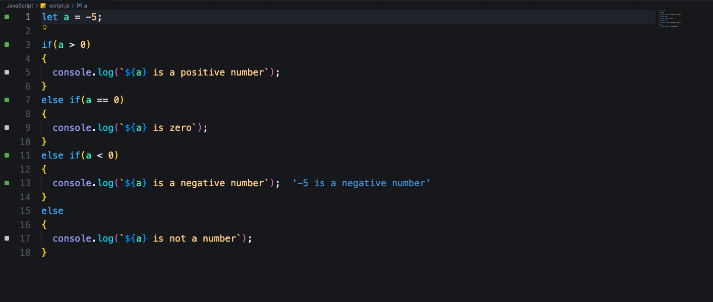

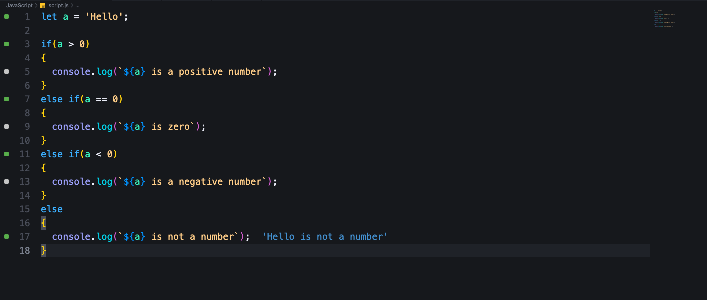

### Example 2 :

``` JavaScript

let weather = 'sunny';

if(weather == 'sunny')
{
  console.log(`Go out freely`);
}
else if(weather == 'cloudy')
{
  console.log(`It might be colde you need a jacket`);
}
else if(weather == 'rainy')
{
  console.log(`You need a rain coat`);
}
else
{
  console.log(`No need for a rain coat`);
}
```

### Output :

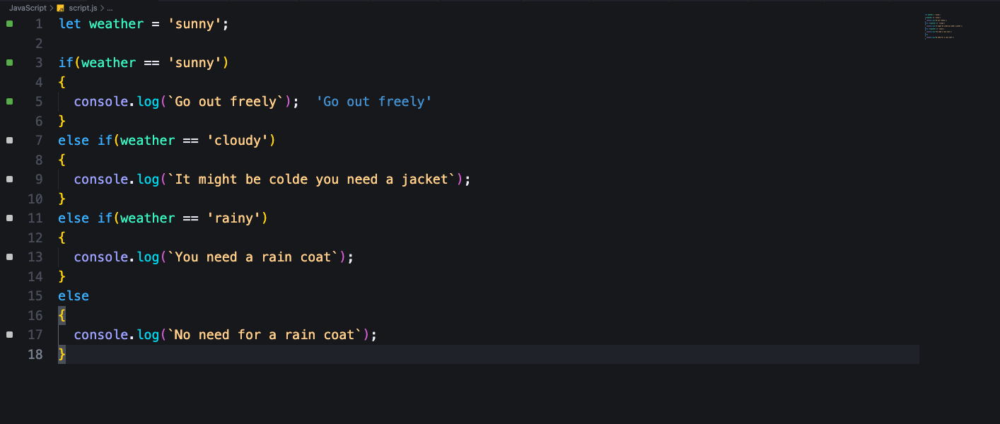

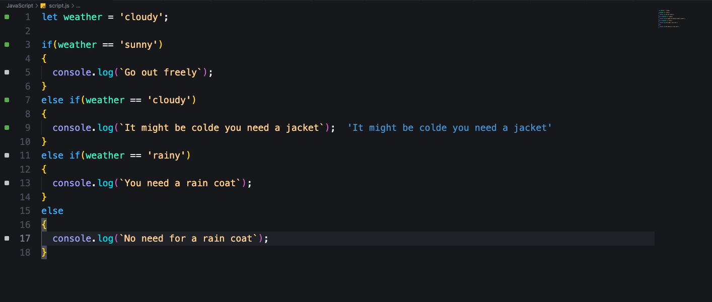

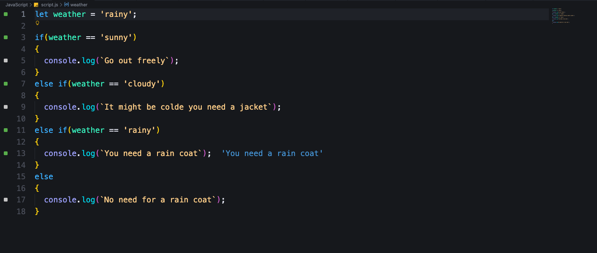

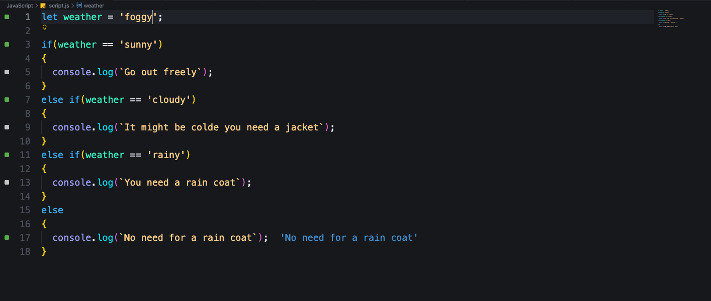

# Switch 

> **Switch** is an alternative for **if else if else else**. The **Swith** statement starts with a ***switch*** keyword followed by a paranthesis and code block.Inside the code block we will have different cases.Case block runs if the value in the **switch. statement parenthesis matches with the case value.** The **break** statement is to terminate execution so the code execution does not go down after the condition is satisfied.The **default** block runs if all the cases don't satisfy the condition.

### Syntax :

``` JavaScript 

switch(caseValue)
{
  case 1:
    // code
    break;
  case 2 :
    // code
    break;
  case 3:
    // code
    break;
  default:
    //code
}
```
### Example 1:

``` JavaScript

let weather = 'cloudy';

switch(weather)
{
  case 'rainy':
    console.log("You need a rain coat.");
    break;
  case 'cloudy':
    console.log("It might be cold, you need a jacket.");
    break;
  case 'sunny':
    console.log("Go out freely");
    break;
  default:
    console.log("No need for rain coat");
}

```
### Output :

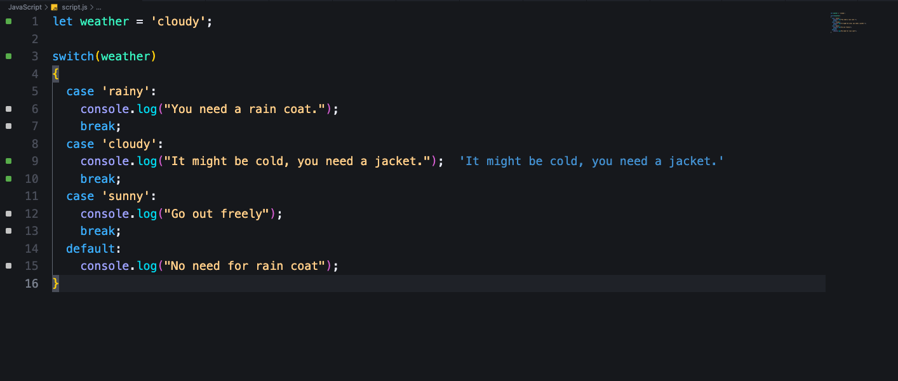

### Example 2 :

``` JavaScript

let dayUserInput= prompt("What day is today ?");
let day=dayUserInput.toLowerCase();

switch(day)
{
  case 'monday':
    console.log("Today is Monday");
    break;
  case 'tuesday':
    console.log("Today is Tuesday");
    break;
  case 'wednesday':
    console.log("Today is Wednesday");
    break;
  case 'thursday':
    console.log("Today is Thursday");
    break;
  case 'friday':
    console.log("Today is Friday");
    break;
  case 'saturday':
    console.log("Today is Saturday");
    break;
  case 'sunday':
    console.log("Today is Sunday");
    break;
  default:
    console.log("It is not a week day");
}

```

### Output

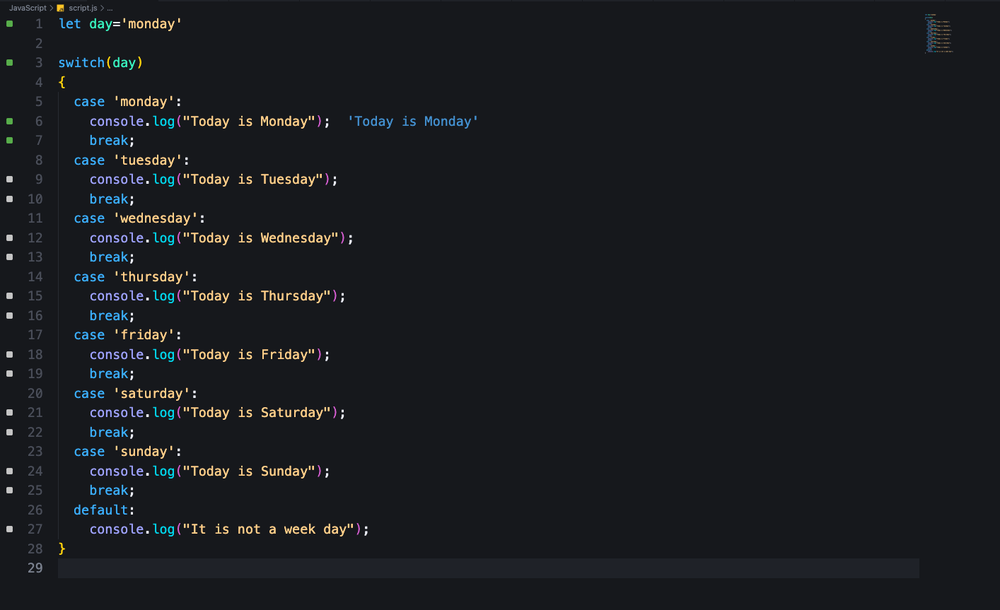

- Examples to use conditions in the cases:

### Example :

``` JavaScript

let num = prompt("Enter a Number");

switch(num)
{
  case num > 0:
    console.log("Given Number is Positive");
    break;
  case num == 0:
    console.log("Given Number is Zero");
    break;
  case num < 0:
    console.log("Given Number is Negative");
    break;
  default:
    console.log("Entered Value was not a Number");
}

```

## Ternary Operators

- Another way to write conditionals is using **ternary operators.** We have covered this in other sections, but we should also mention it here.

### Syntax :

``` JavaScript

condition ? expressionIfTrue : expressionIfFalse;

```

### Example :

``` JavaScript

let isRaining = true;

isRaining?console.log("You need a rain coat"):console.log("No need for a rain coat");

```

### Output :

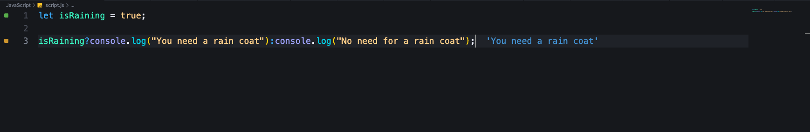

# Day-5

## Arrays

In contrast to variables, an array can store ***multiple values***.Each value in an array has an **Index**, and each **index** has a **reference** in a memory address.Each value an be accessed by using their ***indexes***. The **index** of an array starts from zero, and the **index** of the last element is less by one from the length of the array.

An **array** is a collection of different data types which are ordered and changeable(modifiable). An **array** allows storing duplicate elements and different data types. An array can be empty,  or it may have different data type values.

## How to create an empty array 

In JavaScript, we can create array in different ways.Let us see different ways to create an array.It is very common to use **const** instead of **let** to declare an array variable. If you are using **const** it means you do not use that variable name again.

- **Using Array constructor**

### Syntax :

``` JavaScript

// syntax 

const arr = Array();

           // or

let arr1 = new Array();

console.log(arr);

console.log(arr1);

```

### Example :

``` JavaScript

const arr = Array();

let arr1 = new Array();

console.log(arr);

console.log(arr1);

```

### Output :

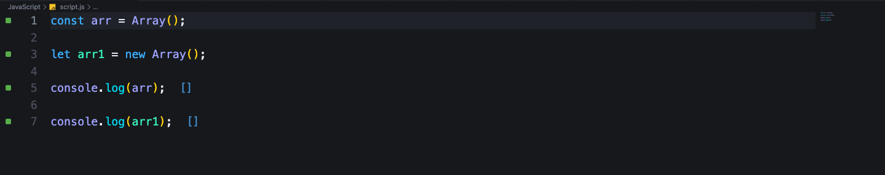

- **Using Square Brackets**

### Syntax :

``` JavaScript

// This is the most recommended way to create an empty list 

const arr = [];

console.log(arr);

```

### Example :

``` JavaScript

let arr = [];

console.log(arr);

```

### Output :

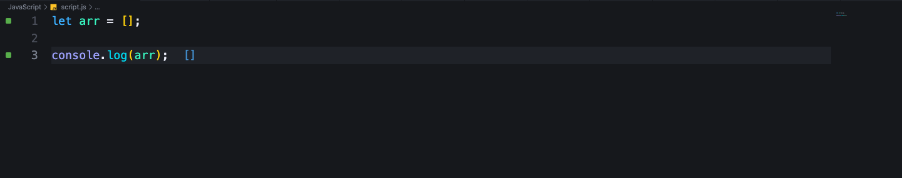

## How to create an array with values 

> Array with initial values. We use ***length*** property to find the length of an array.

### Example :

``` JavaScript

const numbers = [0, 3.14, 9.81, 37, 98.6, 100]; // array of numbers

const fruits = ['banana', 'orange', 'mango', 'lemon']; // array of strings

const vegetables = ['Tomato', 'Potato', 'Cabbage', 'Onion', 'Carrot']; // array of strings

const animalProducts = ['milk', 'meat', 'butter', 'yogurt']; // array of strings

const webTechs = ['HTML', 'CSS', 'JS', 'React', 'Redux', 'NodeJS', 'MongoDB']; // array of strings

const countries = ['Finland', 'Denmark', 'Sweden', 'Norway', 'Iceland']; //array of strings


// Print the array and its length :

console.log(`Numbers : ${numbers}`);
console.log(`Number of numbers : ${numbers.length}`);

console.log(`Fruits : ${fruits}`);
console.log(`Number of fruits : ${fruits.length}`);

console.log(`Vegetables : ${vegatables}`);
console.log(`Number of Vegeatbles : ${vegetables.length}`);

console.log(`Animal Products : ${animalProducts}`);
console.log(`Number of Animal Products :${animalProducts.length}`);

console.log(`Web Techs : ${webTechs}`);
console.log(`Number of webTechs : ${webTechs.length}`);

console.log(`Countries : ${countries}`);
console.log(`Number of Countires :${countries.length}`);

```

### Output :

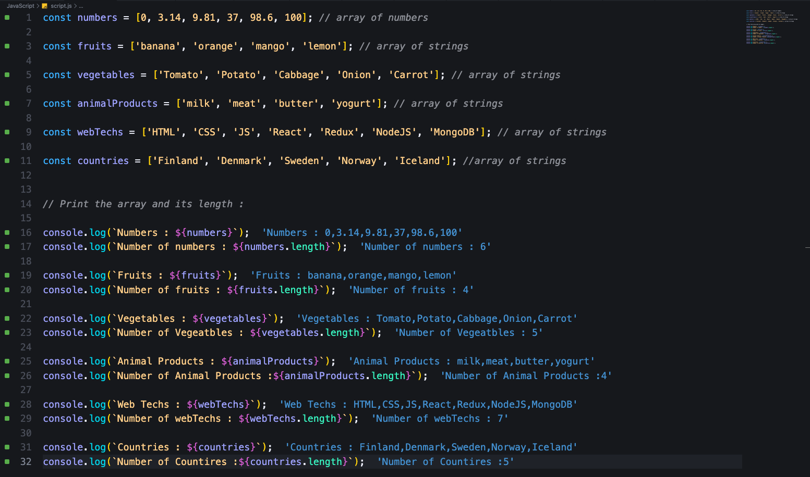

- **Array** can have items of different data types :

### Example :

``` JavaScript

const arrr=[

  'Dibyansh Sharma',
  22,
  true,
  {country:'Finland',city:'Helsinki'},
  {skills:['Html', 'CSS', 'JavaScript', 'React', 'Python']}
] // arrr containing different data types.

console.log(arrr);

```

### Output :

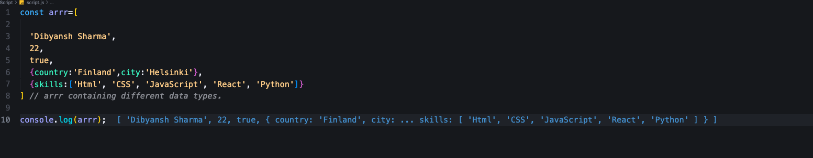

## Creating an array using split

> As we have seen in the earlier section, we can split a string at different positions, and we can change to an array. Let us see the example below:

### Example :

``` JavaScript

let js = 'JavaScript';
const charsInJavaScript = js.split('');
console.log(charsInJavaScript);

let companiesString = 'Facebook, Google, Microsoft, Apple, IBM, Oracle, Amazon';
const companies = companiesString.split(',');
console.log(companies);

let txt = 'I love coding and building stuff. I am Tech Enthusiast';
const words = txt.split(' ');
console.log(words);

```

### Output :

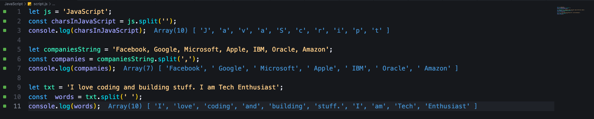

## Accessing array items using index 

We access each element in an array using their index. An array index starts from 0. The picture below clearly shows the index of each element in the array.


### Example 1 :

``` JavaScript 

const fruits = ['banana', 'orange', 'mango', 'lemon'];

let firstFruit = fruits[0];

console.log(firstFruit);

let secondFruit = fruits[1];

console.log(secondFruit);

let lastFruit = fruits[3];

console.log(lastFruit);

let lastIndex=fruits.length-1;

console.log(fruits[lastIndex]);

```

### Output :


### Example 2 :

``` JavaScript 

const numbers = [0, 3.14, 9.81, 37, 98.6, 100]  // Set of numbers

console.log(numbers.length);
console.log(numbers);
console.log(numbers[0]);
console.log(numbers[5]);

let lastIndex = numbers.length-1;

console.log(numbers[lastIndex]);

```

### Output :

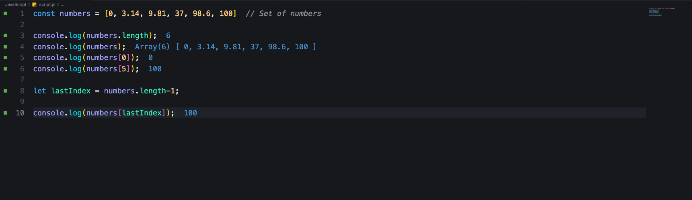

### Example 3 :

``` JavaScript

const webTechs = ['HTML', 'CSS', 'JavaScript', 'React', 'Redux', 'NodeJS', 'MongoDB']; // List of web Technologies

console.log(webTechs);
console.log(webTechs.length);
console.log(webTechs[0]);
console.log(webTechs[6]);

let lastIndex = webTechs.length-1;

console.log(webTechs[lastIndex]);

```

### Output :


### Example 4 :

``` JavaScript

const countries = ['Albania', 'Bolivia', 'Canada', 'Denmark', 'Ethiopia', 'Finland', 'Germany', 'Hungary', 'Ireland', 'Japan', 'Kenya']; // List of countries

console.log(countries);
console.log(countries.length);
console.log(countries[0]);
console.log(countries[7]);

let lastIndex = countries.length-1;

console.log(countries[lastIndex]);

```

### Output :

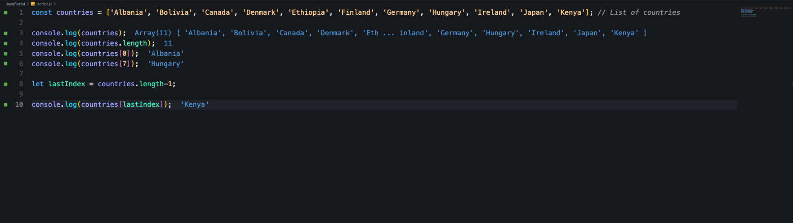

### Example 5 :

``` JavaScript


const shoppingCart = ['Milk', 'Mango', 'Tomato', 'Potato', 'Avocado', 'Meat', 'Eggs', 'Sugar']; // List of food products

console.log(shoppingCart);
console.log(shoppingCart.length);
console.log(shoppingCart[1]);
console.log(shoppingCart[6]);

let lastIndex = shoppingCart.length-1;

console.log(shoppingCart[lastIndex]);

```

### Output :

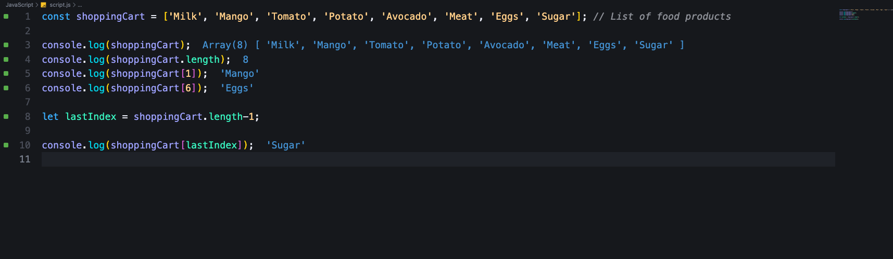

## Modifying array element

> An array is mutable(modifiable). One an array is created, we can modify the content of the array elements.

### Example :

``` JavaScript

const numbers = [1, 2, 3, 4, 5];

numbers[0] = 10;  // changing 1 at index 0 to 10
numbers[1] = 20; // changing 2 at index 1 to 20

console.log(numbers);  

const countries = ['Albania', 'Bolivia', 'Canada', 'Denmark', 'Ethiopia', 'Finland', 'Germany', 'Hungary', 'Ireland', 'Japan', 'Kenya'];

countries[0] = 'Afghanistan';  // Replacing Albania by Afghanistan

let lastIndex = countries.length-1;

countries[lastIndex] = 'Korea'; // Replacing Kenya by Korea

console.log(countries)

```

### Output :

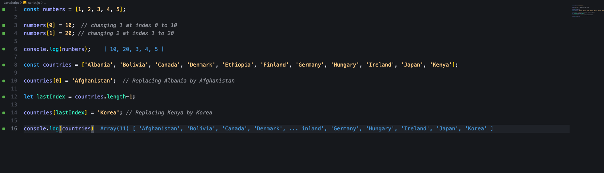


## Methods to manipulate array

There are different methods to manipulate an array. These are some of the available methods to deal with arrays : ***Array, length, concat, indexOf, slice, splie, join, fill, push, pop, shift, unshift, toString, includes, lastIndexOf, isArray.

## Array Constructor 

- **Array** : To create an array.

### Example :

``` JavaScript

const arr = Array() // creates an empty array

console.log(arr);

const eightEmptyValues = Array(8); // It creates an array of length 8 with empty values.

console.log(eightEmptyValues);

```
### Output :

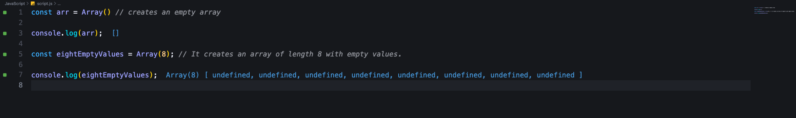

## Creating static values with fill

> **fill** : Fill all the array elements with a static value.

### Example :

``` JavaScript

const arr = Array(); // creates an empty array

console.log(arr);

const eightXvalues = Array(8).fill('X'); // it creates an array of length 8 and its elements are filled with value 'X'

console.log(eightXvalues);

const eight0values = Array(8).fill(0); // it creates an array of length 8 and its elements are filled with value 0

console.log(eight0values);

const four4values = Array(4).fill(4); // it creates an array of length 4 and its elements are filled with value 4

console.log(four4values);

```
### Output :

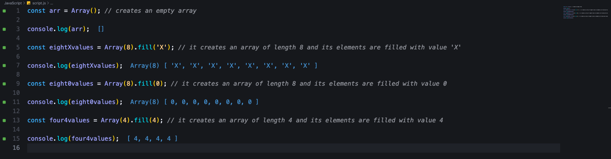

## Concatenating array using concat

> **concat :** To concatenate two arrays.

### Example 1 :

``` JavaScript

let arr1 = [1, 2, 3];

let arr2 = [4, 5, 6];

const arr3 = arr1.concat(arr2);

console.log(arr3);

```

### Output :

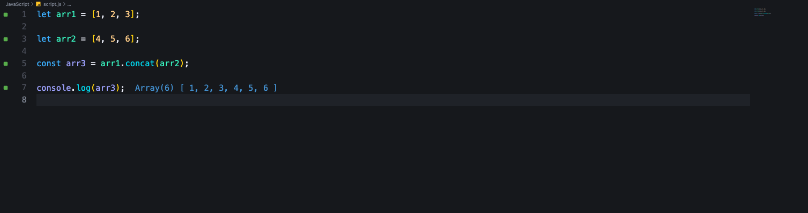

### Example 2 :

``` JavaScript

let fruits = ['Apple', 'Banana', 'Mango', 'Cherry', 'Kiwi'];

let vegetables = ['Tomato', 'Potato', 'Cauliflower', 'Cabbage', 'Spinach'];

const fruitsAndVegetables = fruits.concat(vegetables);

console.log(fruitsAndVegetables);

```

### Output :

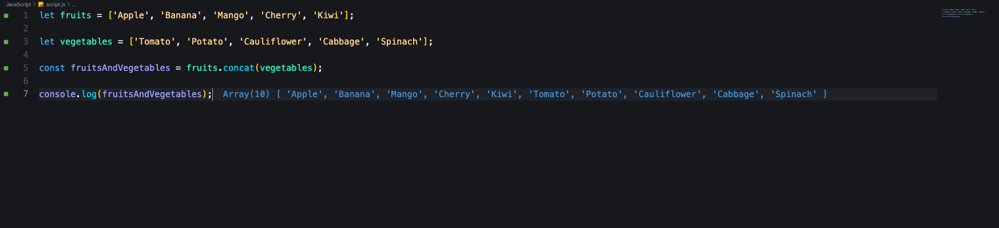

## Getting array length 

> **Length :** To know the size of the array.

### Example :

``` JavaScript

let numbers =[1, 2, 3, 4, 5];

console.log(numbers.length);

```

### Output :

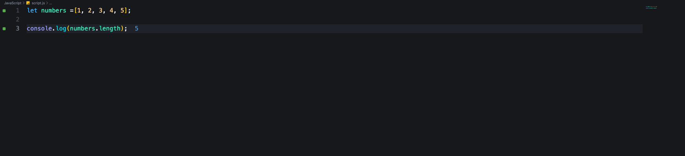

## Getting index of an element in an array 

> **indexOf** : To check if an item exists in an array. If it exists it returns the **index** else it returns **-1**.

### Example :

``` JavaScript

const numbers = [1, 2, 3, 4, 5];

console.log(numbers.indexOf(5));

console.log(numbers.indexOf(0));

console.log(numbers.indexOf(1));

console.log(numbers.indexOf(6));

```

### Output :

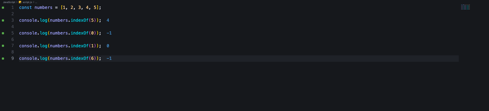

## Check an element if it exists in an array or not .

- Check items in a list

### Example :

``` JavaScript

// let us check if a banana exist in the array or not 

let fruits = ['banana', 'orange', 'mango'];

let index = fruits.indexOf('banana');

if(index === -1)
{
  console.log(`This fruit does not exists in the array`)
}
else
{
  console.log(`This fruit does exist in the array`);
}

// We can also use ternary here

index === -1 ? console.log(`This fruit does not exists in the array`):console.log(`This fruit does exist in the array`);

// Now, let us check if an avocado exist in the array

let indexOfAvocado = fruits.indexOf('avocado'); // -1, if the element not found it returns -1.

if(indexOfAvocado === -1)
{
  console.log(`This fruit does not exist in the array`);
}
else
{
  console.log(`This fruit does exist iin the array`);
}

```
### Output :

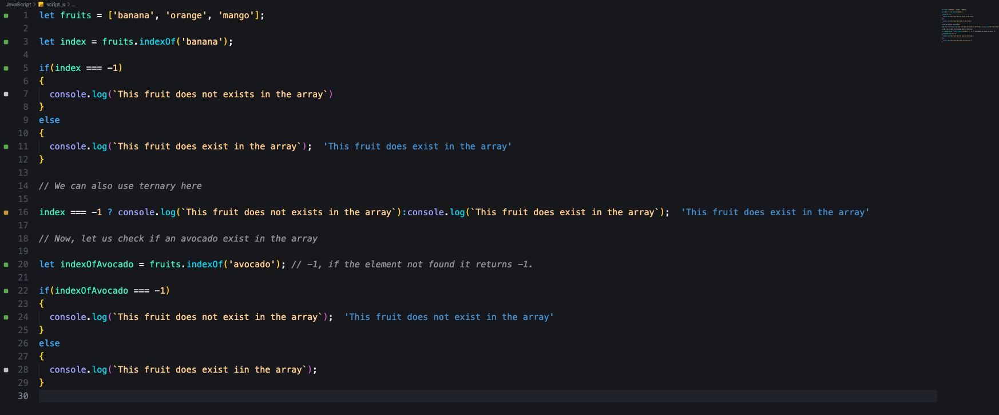

## Getting last index of an element in an array

> ** lastIndexOf() :** It gives the position of the last element in the array. If it exist, it returns the **index** else it returns **-1**.

### Example :

``` JavaScript 

const numbers = [1, 2, 3, 4, 5, 3, 1, 2];

console.log(numbers.lastIndexOf(2));

console.log(numbers.lastIndexOf(0));

console.log(numbers.lastIndexOf(1));

console.log(numbers.lastIndexOf(4));

console.log(numbers.lastIndexOf(6));

```

### Output :

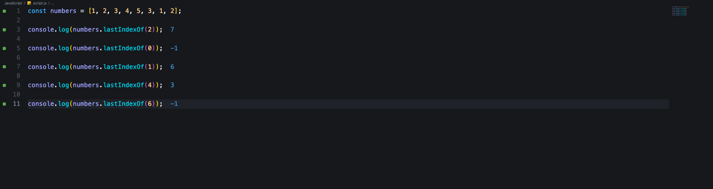

- **includes() :** To check if an item exist in an array. If it exist it returns the **true** else it returns **false**.

### Example :

``` JavaScript

const numbers = [1, 2, 3, 4, 5];

console.log(numbers.includes(2));

console.log(numbers.includes(6));

console.log(numbers.includes(5));

console.log(numbers.includes(10));

const webTechs = ['HTML', 'CSS', 'JavaScript', 'React', 'Redux', 'NodeJS', 'MongoDB']; // list of web Technologies

console.log(webTechs.includes('NodeJS'));

console.log(webTechs.includes('C'));

```

### Output :


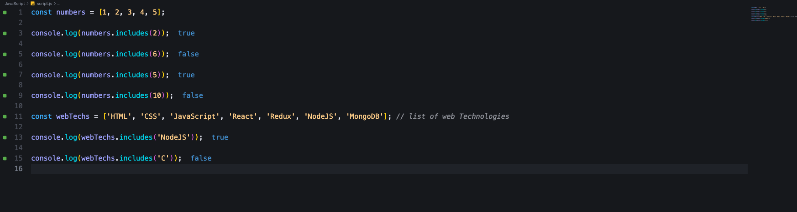

## Checking array 

> **Array.isArray :** To check if the data type is an  array.

### Example :

``` JavaScript

const numbers = [11, 22, 33, 44, 55];

console.log(Array.isArray(numbers));  

const number = 100;

console.log(Array.isArray(number));

```
### Output :

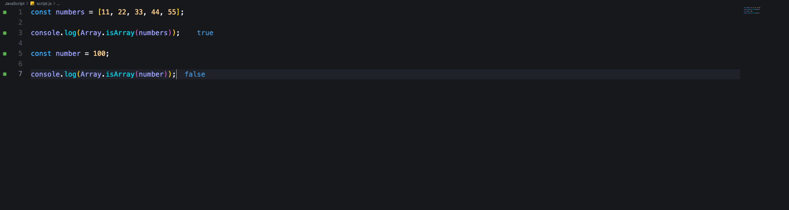

## Converting Array to String

> **toString : ** Converts an array to String

### Example :

``` JavaScript


const numbers = [11, 22, 33, 44, 55];

console.log(numbers.toString());

const names = ['Dibyansh', 'Ananyaa', 'shreya'];

console.log(names.toString());

```

### Output :

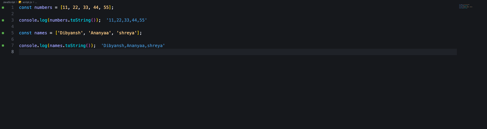

## Joining array elements 

**join()** : It is used to join the elements of the array, the argument we passed in the **join** method will be **joined** in the array and return as a **string**. By default, it **joins** with a **comma**, but we an pass different string parameter which can be joined between the items.


### Example :

``` JavaScript

const numbers = [1, 2, 3, 4, 5];

console.log(numbers.join());

const names = ['Dibyansh', 'Ananyaa', 'Shreya'];

console.log(names.join());

console.log(names.join(''));

console.log(names.join(' '));

console.log(names.join(', '));

console.log(names.join(' # '));

const webTechs = ['HTML', 'CSS', 'JavaScript', 'React', 'Redux', 'NodeJS', 'MongoDB']; // list of web Technologies

console.log(webTechs.join());

console.log(webTechs.join(' # '));

```

### Output :

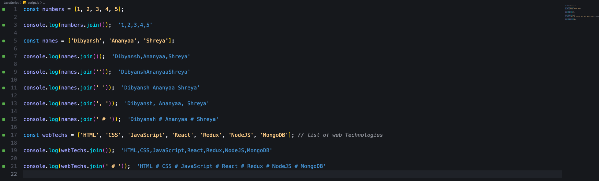

## Slice array elements

**Slice** : To cut out a multiple items in a range. It takes two parameters: **starting and ending position.** It doesn't include the ending position.

### Example :

``` JavaScript

const numbers = [1, 2, 3, 4, 5];

console.log(numbers.slice()); // It copies all items

console.log(numbers.slice(0)); // It copies all items

console.log(numbers.slice(0,numbers.length)); // It copies all items

console.log(numbers.slice(1,4)); // [2,3,4] -> It doesn't include the ending position

```

### Output :

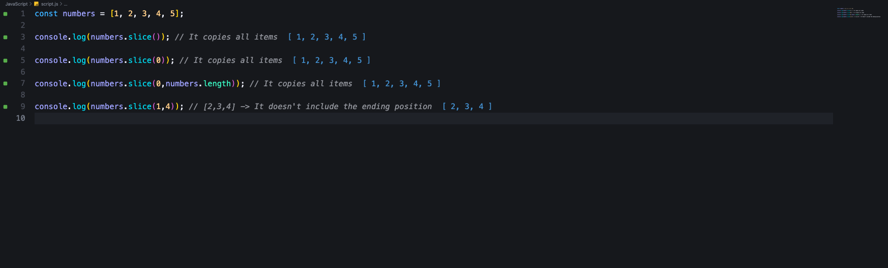

## Splice method in array

**Splice() :** It takes three parameters: **Starting position, number of items to be removed and number of items to be added.**

### Example 1 :

``` JavaScript

const numbers = [1, 2, 3, 4, 5];

numbers.splice();

console.log(numbers);

```

### Output :

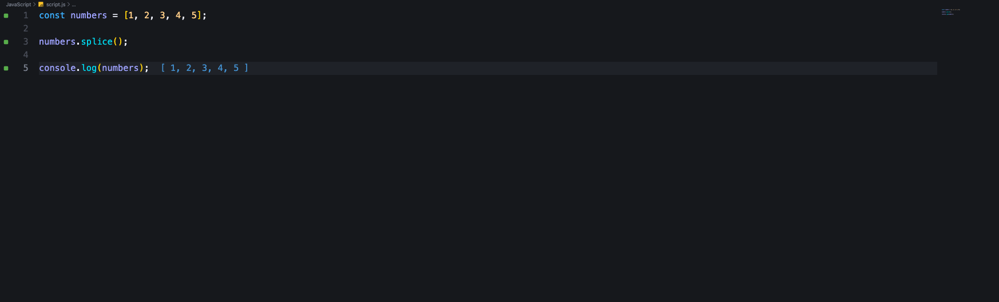

### Example 2 :

``` JavaScript

const numbers = [1, 2, 3, 4, 5];

numbers.splice(0,1);

console.log(numbers);

```

### Output :

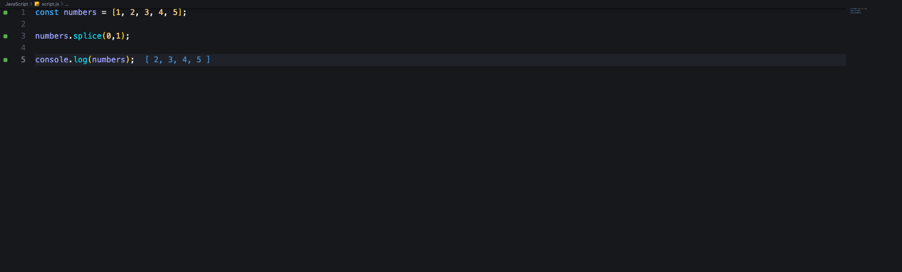

### Examples :

``` JavaScript

const numbers = [1, 2, 3, 4, 5];

numbers.splice(3, 3, 7, 8 , 9);

console.log(numbers);

```

### Output :

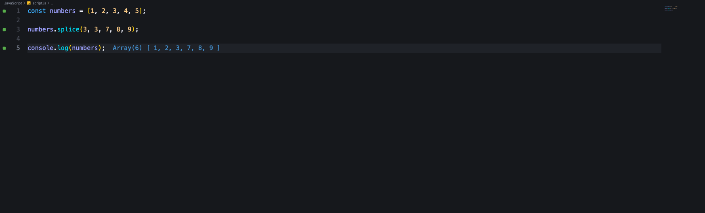

## Adding items to an array using push 

- **Push() :** Adding item in the end. To add an item to the **end** of an existing array we use the **push()** method.


### Syntax :

``` JavaScript

// Syntax 

const arr = ['item1', 'item2', 'item3'];

arr.push('new item');

console.log(arr); // ['item1', 'item2', 'item3', 'new item']

```
### Example 1 :

``` JavaScript

const numbers = [1, 2, 3, 4, 5];

numbers.push(6);

console.log(numbers);

```

### Output :

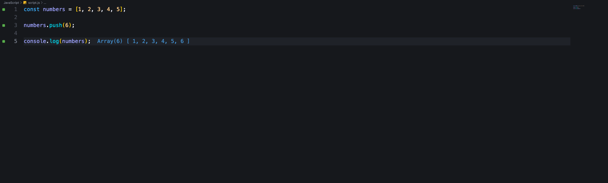

### Example 2 :

``` JavaScript

let fruits = ['banana', 'orange', 'mango'];

fruits.push('Litchi');

console.log(fruits);

fruits.push('Cherry');

console.log(fruits);

```

### Output :

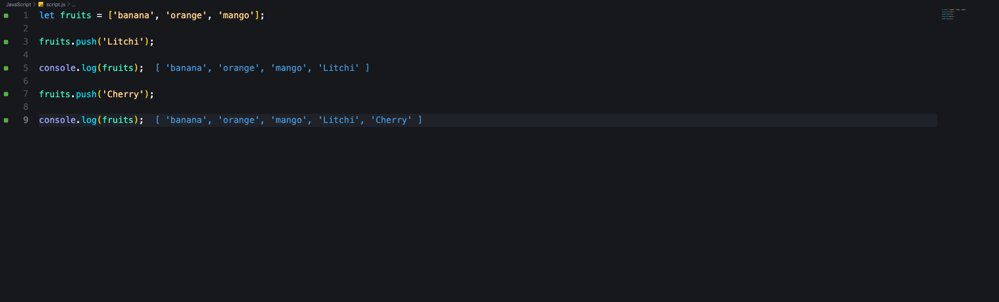


## Removing the end element using pop

- **pop() :** Removing an item in the end.

### Example :

``` JavaScript

const numbers = [11, 22, 33, 44, 55];

console.log(numbers);

numbers.pop();

console.log(numbers);

let poppedElement = numbers.pop();

console.log(poppedElement);

console.log(numbers);

```

### Output :

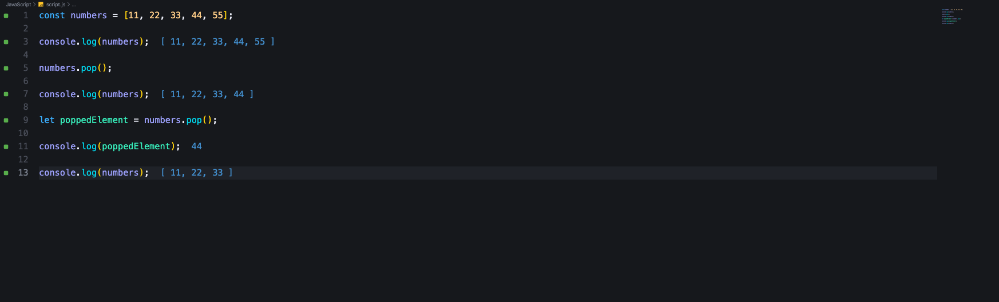

## Removing an element from the beginning

- **shift() :** Removing one array element in the beginning of the array.

### Example :

``` JavaScript

const numbers = [1, 2, 3, 4, 5];

console.log(numbers);

numbers.shift();

console.log(numbers);

let shiftedElement = numbers.shift();

console.log(shiftedElement);

console.log(numbers);

```

### Output :

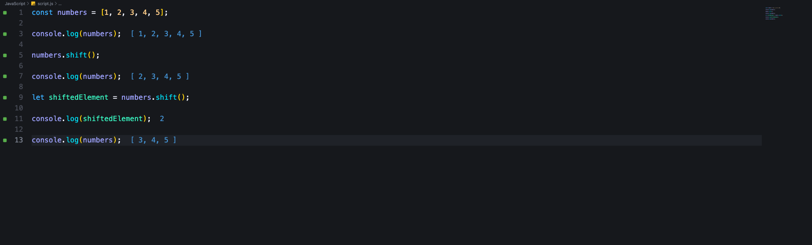

## Adding an element in the beginning of the array 

- **unshift() :** Adding an element in the beginning of the array.

### Example :

``` JavaScript

let numbers =[11, 22, 33, 44, 55];

console.log(numbers);

numbers.unshift(99);

console.log(numbers);

```

### Output :

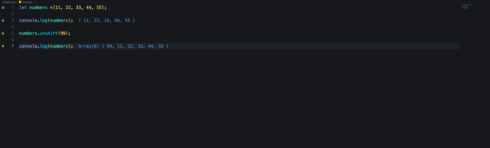

## Reversing Array Order 

- **reverse() :** It reverse the order of an array.

### Example :

``` JavaScript

const numbers = [1, 2, 3, 4 ,5];

console.log(numbers);

numbers.reverse();

console.log(numbers);

numbers.reverse();

console.log(numbers);

```

### Output :

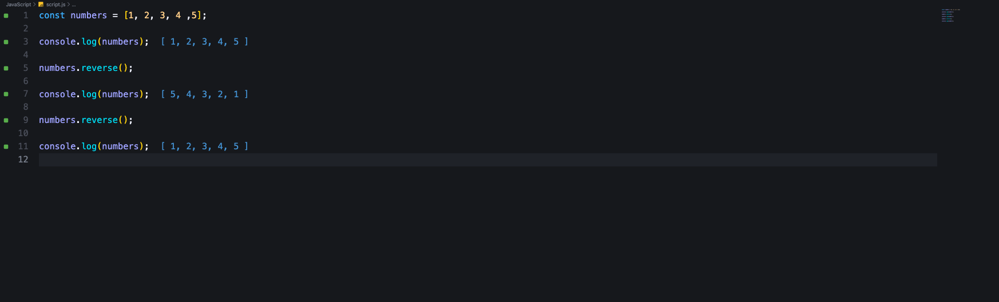

## Sorting Elements in array 

- **sort() :** Arrange array elements in **ascending order**. Sort takes a call back function, we will see how we use sort with a call back function in the coming sections.

### Example :

``` JavaScript

const webTechs = ['HTML', 'CSS', 'JavaScript', 'NodeJS', 'React', 'Redux', 'MongoDB', 'Tailwind CSS', 'TypeScript'];

console.log(webTechs);

webTechs.sort();

console.log(webTechs);

// After sorting you can reverse it 

webTechs.reverse();

console.log(webTechs);

```

### Output :

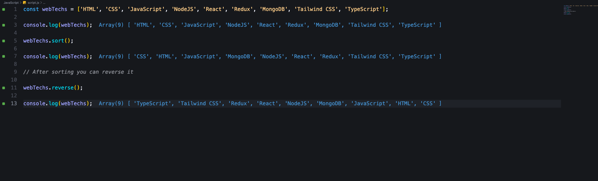

## Array of arrays 

- **Array** can store different data types including an array itself. Let us create an **array of arrays.**

### Example :

``` JavaScript

const arr1 = [1, 2, 3, 4, 5 ];

const arr2 = [11, 22, 33, 44, 55];

const arrayOfArray = [[1, 2, 3, 4, 5],[11, 22, 33, 44, 55]];

console.log(arrayOfArray[0]);

console.log(arrayOfArray[1]);

console.log(arrayOfArray[1][1]);

console.log(arrayOfArray);

const frontEnd = ['HTML', 'CSS', 'Tailwind CSS', 'React', 'Redux', 'NextJS'];

const backEnd = ['JavaScript', 'TypeScript', 'NodeJS', 'Express', 'MongoDb', 'JWT'];

const fullStack =[frontEnd,backEnd];

console.log(fullStack);

console.log(fullStack.length);

console.log(fullStack[0]);

console.log(fullStack[1]);

console.log(fullStack[0][1]);

```

### Output :

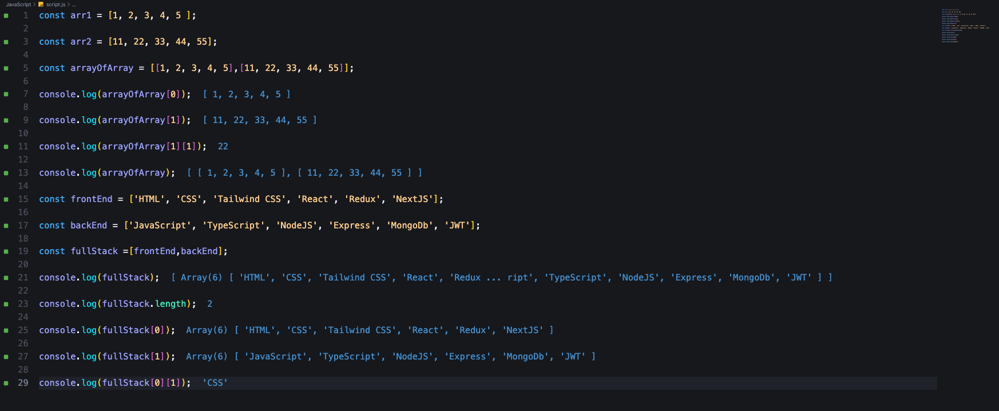


