### Introduction to Data Types
---

In JavaScript and other programming languages, there are different types of data types. The following are JavaScript primitive datatypes : String, Number, Boolean, undefined, Null and Symbol.

## Numbers

- Integers : Integer (negative,zero and positive) numbers Example : ... -3,-2,-1, 0 ,1, 2, 3...

- Float-point Numbers : Decimal Number Example ...-3.5, -2.25, -1.0, 0.0, 1.1, 2.2, 3.5...

## Strings

A Collection of one or more characters between two single quotes, double quotes, or backticks.

**Example:**

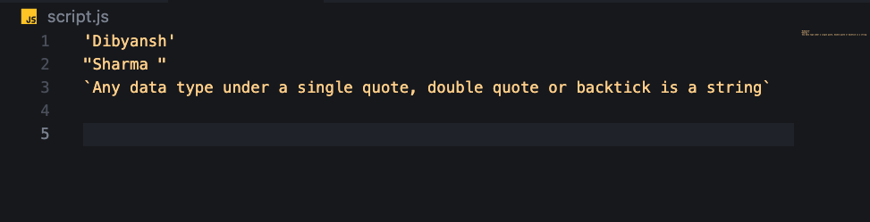

## Booleans 

A boolean value is either true or False. Any comparisons return a boolean value, whih is either true or false.

- A boolean data type is either a true or false value.

**Example:**

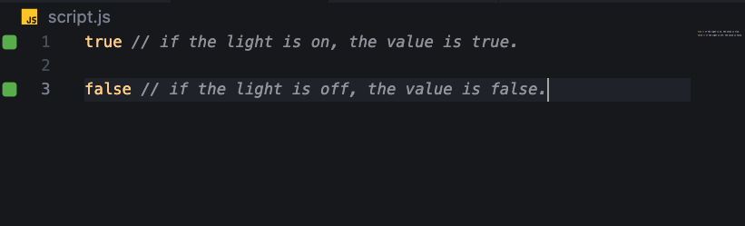

## Undefined

In JavaScript, if we don't assign a value to a variable, the value is undefined. In addition to that, if a function is not returning anything, it returns undefined.

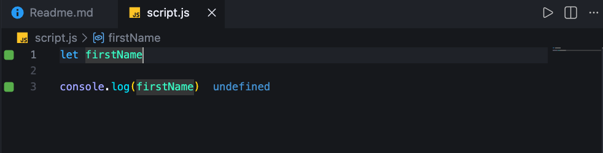

## Null

Null in JavaScript means an empty value.

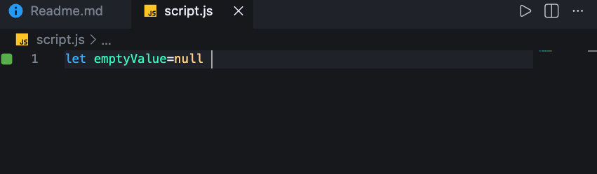

## Checking Data Types

To check the data type of a certain variable, we use the **typeof** operator. See the following example :

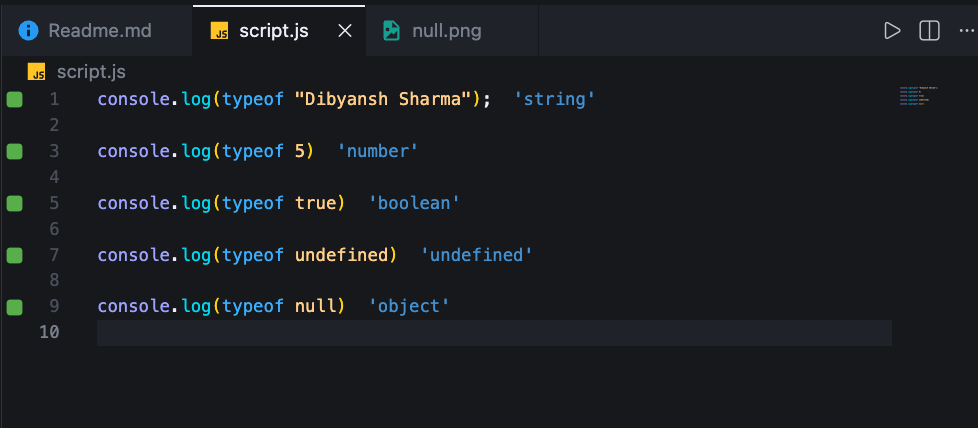

## Comments

Remember that commenting in JavaScript is similar to other programming languages. Comments are important in making your code more readable.There are two ways of commenting:

- Single line Commenting
- Multiline Commenting

**Single line Commenting**

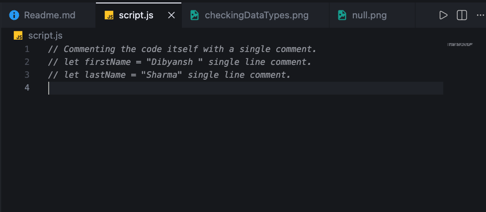

**Multi-line Commenting:**

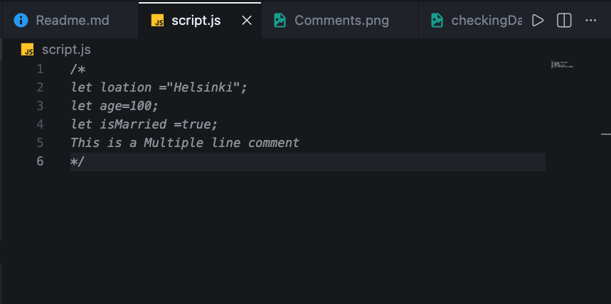

## Variables

Variables are *containers* of data. Variables are used to store data in a memory location.When a variable is declared, a memory location is reserved.When a varibale is assigned to a value(data), the memory space will be filled with that data.To declare a variable, we use *var*, *let*, or *const* keywords.

For a variable that changes at a different time, we use *let*. If the data does not change at all, we use const. For example, 
**PI**, **country name**, **gravity** do not change, and we can use const.We will not use var in this challenge and I don't recommend you to use it. It is error prone way of declaring variable it has lots of leak.We will talk more about **var**, **let**, and **const** in detail in other sections (scope).For now, the above explanation is enough.

A valid JavaScript variable name must follow the following rules:

- A JavaScript variable name should not begin with a number.
- A JavaScript variable name does not allow special charaters except dollar sign and underscore.
- A JavaScript variable name follows a camelCase convention.
- A JavaScript variable name should not have space between words.

The following are examples of valid JavaSript variables.

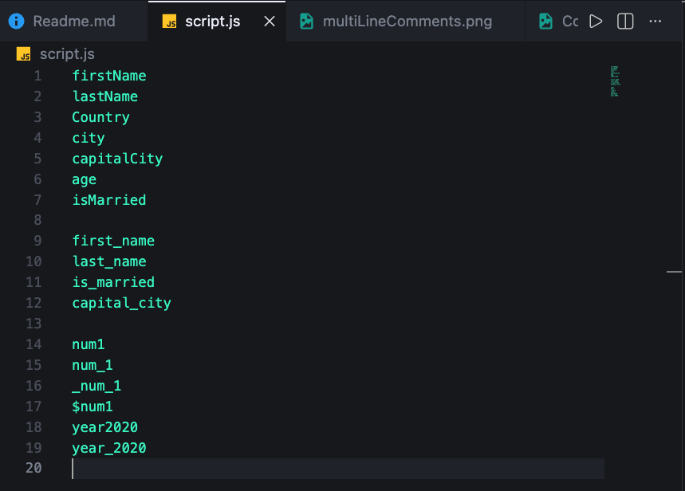

The first and second variables on the list follows the **camelCase** convention of delaring in JavaSript. In this material, we will use camelCase variables(camelWithOneHump).We use CamelCase(CamelWithOneHump) to declare classes, we will discuss about classes and other objets in other section.

**Example of inavlid variables:**

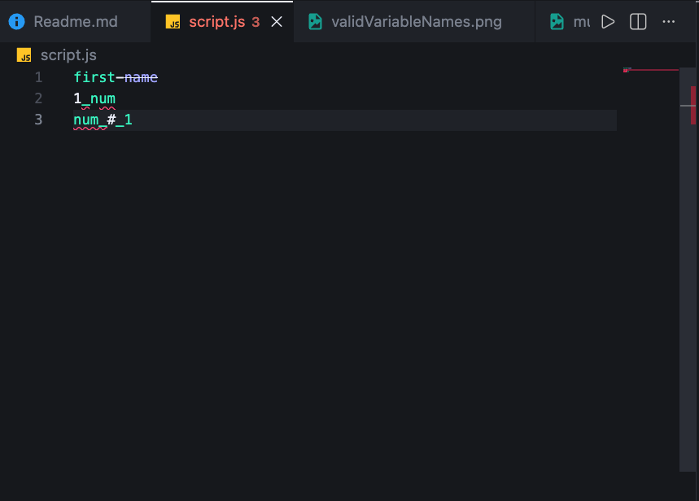

Let us declare variables with different data types.To declare a variable, we need to use **let** or **const** keyword before the variable name. Following the variable name, we write an equal sign(assignment operator), and a value(assigned data).

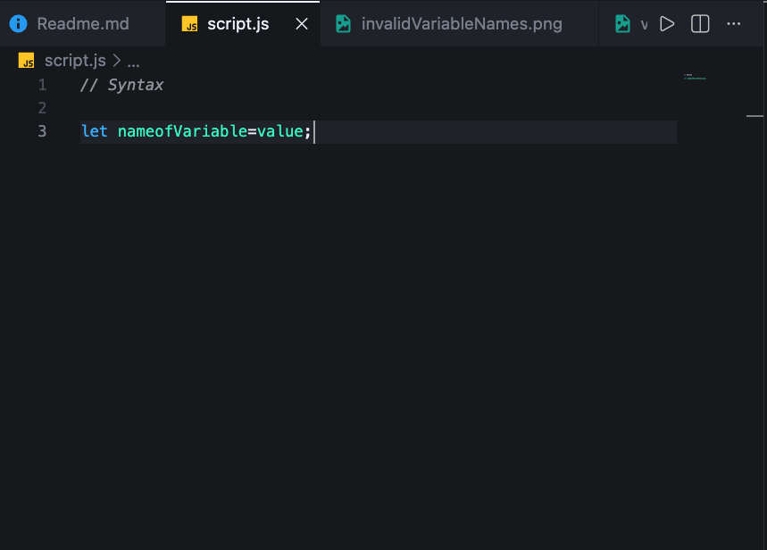

The ***nameofVariable*** is the name that stores different data of value. See below for detail examples:

**Examples of declared variables**

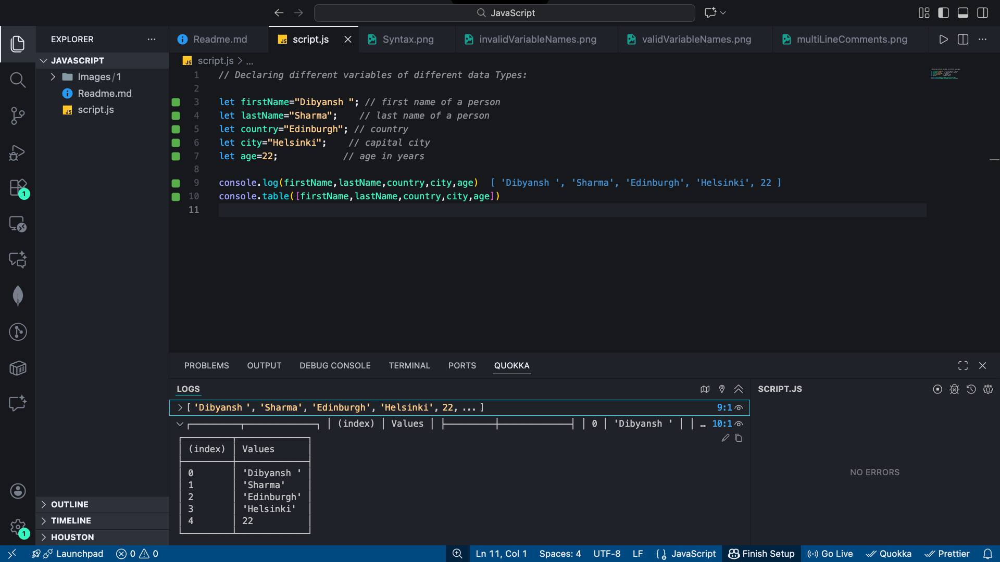

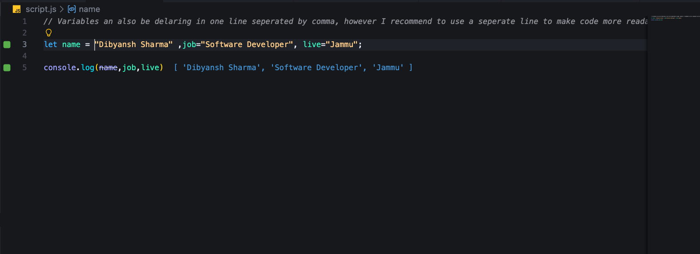

